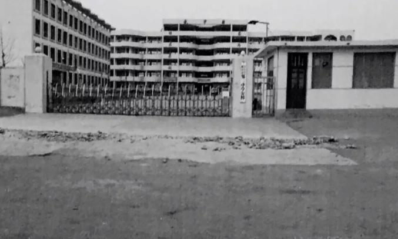
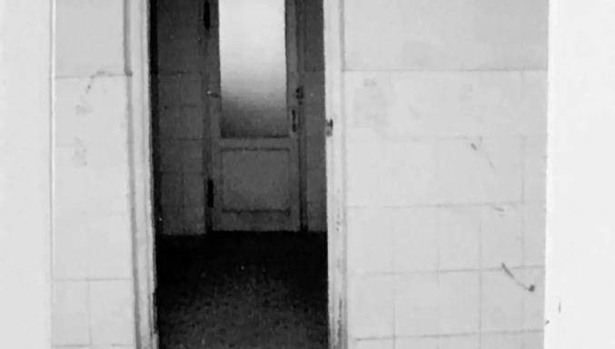
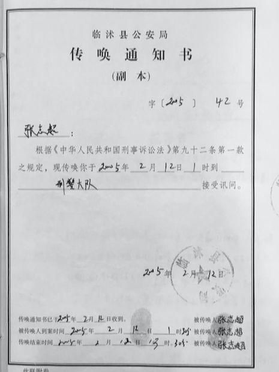
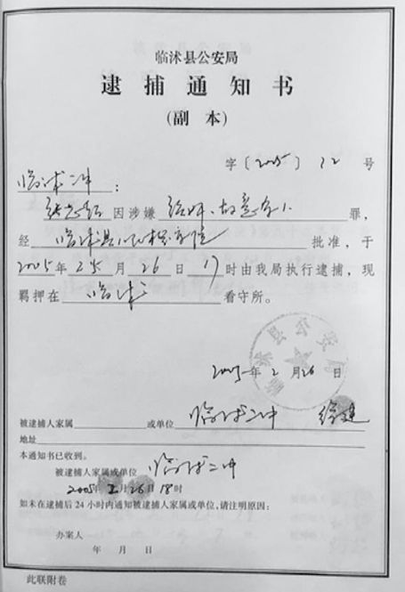
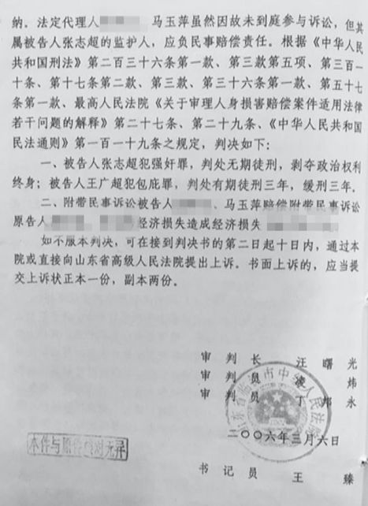
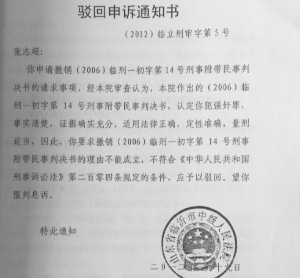
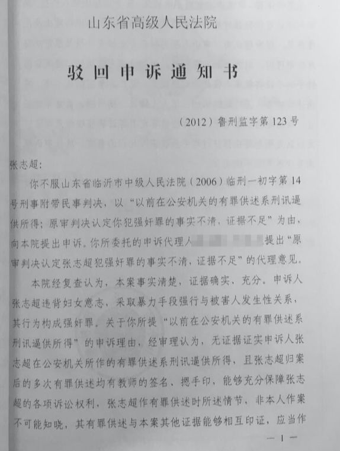
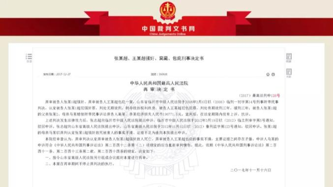

| :-: | 报道时间/期数   | 文章标题                               | 报道平台     | 链接                                                                                     |
| --- | --------- | ---------------------------------- | -------- | -------------------------------------------------------------------------------------- |
| 1   | 2015年第17期 | 花季少年校园奸杀案疑云                        | 民主与法制网   | [花季少年校园奸杀案疑云](http://e.mzyfz.org.cn/mag/paper_4734_3768.html)                          |
| 2   | 2016年第31期 | 山东中学生张志超奸杀案复查第二次延期，最高法曾调取阅卷        | 澎湃新闻     | [山东中学生张志超奸杀案复查第二次延期，最高法曾调取阅卷](https://www.thepaper.cn/newsDetail_forward_1504532)      |
| 3   | 2019年第34期 | 《张志超无罪归来》系列报道之四 学者关注，为张志超案而表达的理性建言 | 民主与法制电子刊 | [《张志超无罪归来》系列报道之四 学者关注，为张志超案而表达的理性建言](http://e.mzyfz.org.cn/mag/paper_35198_18166.html) |
| 4   | 2020年1月   | 改判无罪！"张志超案"再审今日宣判                  | 澎湃新闻     | [改判无罪！"张志超案"再审今日宣判](https://m.thepaper.cn/baijiahao_5508231)                           |
| 5   | 2020年第4期  | 依法纠错，《民主与法制》一直在路上——以张志超案平反历程为视角    | 民主与法制电子刊 | [依法纠错，《民主与法制》一直在路上——以张志超案平反历程为视角](http://e.mzyfz.org.cn/mag/paper_41861_21473.html)    |
| 6   | 2020年第4期  | 张志超案，缘何来来回回走了15年？                  | 民主与法制电子刊 | [张志超案，缘何来来回回走了15年？](http://e.mzyfz.com/mag/paper_35195_18151.html)                     |
| 7   | 2020年第4期  | 律师代理，为张志超案所付出的专业智慧                 | 民主与法制电子刊 | [律师代理，为张志超案所付出的专业智慧](http://e.mzyfz.com/mag/paper_35196_18157.html)                    |
| 8   | 2020年第4期  | 张志超案时间轴                            | 民主与法制电子刊 | [张志超案时间轴](http://e.mzyfz.com/mag/paper_35200_18173.html)                               |

# [花季少年校园奸杀案疑云](http://e.mzyfz.org.cn/mag/paper_4734_3768.html)
----------------------------------------------------------------------------------------------------------------------------------------------------------------------------------------------------------------------------------------
作者：■ 本社记者 李蒙   时间：2015-6-12 15:21:38
----------------------------------------------------------------------------------------------------------------------------------------------------------------------------------------------------------------------------------------

## 校园惊现女尸，花季少年被判无期
-   　2005年1月10日，星期一，清晨6时15分左右，山东省临沂市临沭县第二中学新校校门口，走进来两位高一女学生，高婷（化名）和王燕（化名）。那天，山东临沂地区的天亮时间是7时13分22秒，6点多时天还是黑的。
-   　进入校门后，从校门到教学楼有一条两百多米长的笔直水泥路面。高婷是坐着王燕的自行车来到学校的，一进校门，就听到了举行升国旗仪式的集合铃声，王燕急忙去停放自行车，而高婷则朝前走向教学楼。分手时，高婷还从王燕的自行车车斗里取走了自己的钱包和两本英语课本。等王燕停好车再去找高婷时，高婷已经消失在黎明前的黑暗中。
-   　这是王燕与高婷人生的最后一次交集，一个月后，高婷的尸体出现在该校教学楼三楼的一间洗刷间里。
-   　据当时在临沭二中新校宿管科担任清扫工的老人李贞梅回忆，位于教学楼西端的宿舍楼三楼楼道东侧、楼梯北侧的第一间房，本来是男洗刷间，内部分为两部分，西半部是洗刷区，东半部是男厕所，中间有木门相隔。2004年冬天，因为厕所里的水抽不上来，校领导说这洗刷间别用了，让把中间的木门锁上。
-   　2005年2月11日，李贞梅开始打扫教学楼。那天是农历大年初三，正在寒假期间，初八学生们就要返校了。下午14时许，打扫到三楼这个洗刷间时，李贞梅发现，拿钥匙打不开木门的锁了。木门是宿管科锁的，钥匙一直由宿管科保管，怎么开不了锁呢？
-   　李贞梅找了把钳子将锁撬掉，打开木门……里面中间是条过道，过道南北两侧各有用矮墙相隔的三个蹲坑大便池。突然，在过道北边最靠东的那个大便池里，有一双赤裸的脚伸出来，没有鞋袜，连露出来的小半条腿也是赤裸的！
-   　死尸！片刻的惊悚后，李贞梅急忙下楼报告了学校值班老师，老师迅速报警。临沭县公安局民警赶到现场勘查，证实死者正是一个月前失踪的高一（20）班女生高婷。
-   　高婷那年刚满16岁，是班里的文娱委员，性格开朗，交友较多。她1月10日与王燕分手后，便消失在了人们的视线中。
-   　临沭县公安局民警迅速展开排查，询问了发现尸体的李贞梅以及最后见到高婷的王燕、高婷的班主任等人，也询问了临沭二中新校的众多学生，一个叫张志超的不满16岁的高一学生进入了警方的视野。
-   　高一学生杨同振和王绪波，先后告诉警方，在高婷失踪的1月10日清晨6时10分左右，他们在宿舍内听到外面传出女生“啊啊”的尖叫，随后尖叫声变得越来越惨，持续了两分钟后才停止。两人闻声跑出宿舍，看到南面10米远的洗刷间（即发现高婷尸体处）门口站着两个人。王绪波说，其中一人是张志超。
-   　2月13日凌晨，张志超在家中被警方带走。当天，他被刑事拘留。26日，被逮捕。2006年1月16日，山东省临沂市检察院对张志超和同案包庇犯王广超提起公诉。2月20日，山东省临沂市中级法院不公开开庭审理了此案。庭审时，张志超和王广超对公诉人的指控均未作辩解。3月3日，临沂中院一审以强奸罪判处张志超无期徒刑，剥夺政治权利终身；以包庇罪判处王广超有期徒刑三年，缓刑三年。一审判决后，张志超、王广超均未上诉。
-   　判决书认定的事实是：“2005年1月10日6时20分许，被告人张志超在教学楼一洗刷间内遇到被害人高婷，见四周无人，即起奸淫之心，遂上前用随身携带的铅笔刀架在高婷的脖子上，将其劫持至洗刷间内，采用捂嘴、掐脖子等手段将高婷强奸，并致其窒息死亡。随后，被告人张志超离开洗刷间时遇见被告人王广超，将其犯罪实情告诉王广超，并让王广超帮助看守洗刷间，后被告人张志超到学校的小卖部购买一新锁将废弃厕所锁住。2005年1月11日下午，被告人张志超趁其他同学上课之机，又携带铅笔刀，潜入该废弃厕所内奸尸，并将尸体多处割破。2月12日，公安机关传唤被告人王广超时，王广超明知张志超系犯罪的人，却故意作虚假证言，对其包庇。”

## 6年后才开始的艰难申诉
-   　张志超的父母都是下岗职工，家境比较困难。案发时，张志超父亲已经病得很重，母亲马玉萍因张志超的事大受打击，也一病不起。她始终不相信儿子会做出那么伤天害理的事，每次去少管所探视张志超时，都问他：“儿啊，这事儿是不是你干的？不是你干的，你要告诉妈妈呀！”但每次张志超都不回答，只是以泪洗面。直到2011年的一天，马玉萍再次问张志超时，张志超终于说：“妈，这事儿不是我干的，跟我一点关系都没有。”
-   　张志超对母亲说，当年承认自己是凶手，是被警方刑讯逼供的结果。开始被带到刑警队后，他不承认是自己作的案，就被抽耳光，有人过来将他的衣服脱了，用两个电棍电击他脖子和全身，两人在身前用脚踢，用铁扳手砸膝盖和脚趾头。受刑不过，张志超被迫承认是自己所为，并按照警方的提示完成了口供。
-   　马玉萍也回忆起，张志超被抓走后，有一天她去公安局找儿子，一个警察告诉他，你儿子在刑警队。马玉萍就去刑警队找，无意中走到一个房门前，听到里面有电棍发出的“刺啦刺啦”的声音，她从门缝里看到了儿子。张志超也看到了她，喊了一声：“妈。”里面的警察发现了门口的马玉萍，立即出来，一人薅住她的脖领子将其推到楼梯口。如果不是扶住栏杆，马玉萍险些摔倒。记忆中儿子坐在地上，表情很痛苦。
-   　庭审时为何不辩解及一审判决后为什么没有上诉？张志超说，当初检察院的检察官来讯问他时，他曾告诉检察官，自己是被打承认的，要求检察院提取血液、毛发等物证，检察官给他作了笔录。可翻供的当晚，曾提审他的公安局刑警将他从看守所提出，再次抽耳光、用电棍电击，对他说：“你找谁都没用，最后还是我们查。”
-   　庭审时他刚满16周岁，对司法程序根本不懂，不知道上诉是怎么回事，认为上诉也没用。
-   　张志超说，强奸犯在监狱里是最被其他犯人歧视的，当年向检察官翻供后的遭遇，使他心有余悸，对谁也不敢说出真相。他说，在电视里看到佘祥林的母亲因为为儿子申诉冤案被劳教了，就很担心告诉母亲真相后母亲也去申诉，再引起牢狱之灾。
-   　光阴荏苒，几年过去，张志超长大了，也有意识地学习些法律知识，懂得了自己有申诉的权利，开始向身边要好的狱友悄悄诉说自己的冤屈。狱友们听说后都很震惊，告诉他，不是你干的你就一定要申诉，不能背一辈子黑锅。在大家的鼓励下，他终于向母亲说出了真相。

## 签字教师不在场，同案犯翻供
-   　马玉萍开始找律师为儿子申诉。几年下来，律师换了三拨，但案件却没有突破性的进展。
-   　在律师的帮助下，张志超向临沂市中级人民法院、山东省高级人民法院相继提起申诉。2012年3月19日，临沂中院驳回张志超的申诉，未说明具体理由。11月12日，山东省高院也驳回其申诉，理由是：“无证据证实申诉人张志超在公安机关所作的有罪供述系刑讯逼供所得，且张志超归案后的多次有罪供述均有教师的签名、摁手印，能够充分保障张志超的各项诉讼权利，张志超作有罪供述时所述情节，非本人作案不可能知晓，其有罪供述与本案其他证据能够相互印证，应当作为定案的依据。”
-   　在张志超的所有在卷询问笔录的每一页纸上，的确有临沭二中教师苏某、徐某的签字。当时苏某是年级主任，徐某是张志超的班主任。但二人在山东省高院复查时、在张志超代理律师调查取证时多次声明：公安机关审讯张志超时，他们都不在场，只是被公安机关叫到刑警队后，公安人员给他们一份笔录让他们签字摁手印，他们就签了字摁了手印。二人只在楼道里看到张志超从身边经过，没有任何交谈。
-   　张志超案发时适用的是1996年修正的刑诉法，第十四条规定：“对于不满十八岁的未成年人犯罪的案件，在讯问和审判时，可以通知犯罪嫌疑人、被告人的法定代理人在场。”而在2012年修订的新刑诉法中，“可以”被改为“应当”。按照1996年的刑诉法，讯问张志超时，其法定代理人也“可以”在场。如果马玉萍所述她去公安局刑警队看到儿子后被强行推出讯问现场的情况属实，临沭警方的行为其实是非法剥夺了张志超母亲的“在场权”。
-   　申诉被山东高院驳回后，马玉萍聘请律师继续向最高人民法院申诉。2014年3月，代理律师远赴浙江宁波，对已在当地打工的王广超进行了调查取证。
-   　王广超陈述，2005年1月10日那天，自己去参加升旗仪式和跑操了，但不记得是否见过张志超，自己当初向公安机关的陈述全是虚假的，是被逼迫和诱供的结果。侦查人员在提讯他的时候，没有家属或老师在场，只是在最后去看守所之前，在刑警队里把他的班主任叫过去见了一面。审讯的时候，“拳打脚踢，用电棍击打，提示我说什么，后来就形成了口供。”他说他是到了刑警队之后，才知道高婷被杀的。
-   　2014年下半年，北京大禹律师事务所的李逊律师接受委托，开始代理张志超案的申诉。他不仅免费代理，连办案差旅费都是自掏腰包，已经辗转北京、临沭、淄博多地，调查现场，会见当事人，因为他坚信此案有冤情。

## 作案时间何在？
-   　记者查阅了警方当年对临沭二中新校多位教师和学生的讯问笔录，结合实地调查，基本厘清了2005年1月10日高婷失踪当天学校的作息时间。
-   　2005年1月10日是星期一，临沭二中新校只在周一升国旗，平时不升国旗的时候，学生要绕着教学楼跑三圈，周一升国旗的时候只跑一圈。学生起床时间是清晨6点。升国旗的时间是6时15分。升国旗仪式结束后，还会有学生代表讲话，说一些“我们班是一个团结的班”之类。国歌时长46秒，升旗仪式一般播放两次，从学生集合、升旗到学生代表讲完话，应该是在6时20分到25分之间。跑步开始的时间无法确定，跑完的时间也无法确定，但跑完一圈的时间基本可以确定，教学楼周长只有280米，正常人跑完一圈一般也就是40到50秒。考虑到学生众多，不可能都是快跑，时间应该是在两三分钟之间。跑完后，学生们就上教学楼回到教室。而早自习的时间是6时35分到7时15分。
-   　当时，张志超在哪里？卷宗里有于峰、孙兵、刘军、王全（皆为化名）的询问笔录，证实张志超当天参加了升国旗仪式。也就是说，在升国旗仪式结束时，张志超是在教学楼下的旗杆附近。
-   　当时是冬天，一些学生跑步前，会将自己穿的棉袄脱下来。这些棉袄放到哪里？张志超是班长，他向班主任徐某提出，由他每天将大家脱下来的棉袄抱到三楼教室里去，徐某同意了。记者向徐某当面询问时，他也证实了这一情况。多位学生的证词显示，当天抱棉袄上楼的是张志超和李磊（化名）。
-   　记者实地调查，张志超和李磊抱着棉袄从旗杆处上到三楼教室，需要1分30秒到两分钟左右。放下棉袄，他和李磊，还有因病没有去参加升旗仪式和跑操的孙兵，三人有过交谈。张志超回忆，当时他想去上厕所，孙兵和他一起从教室出来，李磊没跟着。开始想去20米外的洗刷间（即发现高婷尸体处），但因为这个洗刷间已经被学校停用了，孙兵说，别去那里了，还是去二楼吧。两人就一起去了二楼。在二楼楼梯口，遇到了杨同振。
-   　记者实地调查，证人王绪波、杨同振的宿舍距离发现高婷尸体的洗刷间很近，只有11米，正常行走只需10秒钟。按照王绪波的说法，他们先是听到了女生求救的尖叫声，尖叫声持续了几十秒，叫得很惨烈。两三分钟后，他和杨同振一起从宿舍里跑出来，看到张志超和王广超在洗刷间门口。他跑到洗刷间（走才需要10秒）外，朝里一看，里面的木门是锁好的。也就是说，张志超离开他人视线，独处的时间只有两三分钟，如果是他作案，那么在短短两三分钟时间内，张志超要完成如下动作：掐高婷的脖子，将其拖入洗刷间，强奸、杀害，藏入洗刷间东半部的废弃厕所里，关上门，遇到王广超，告知其自己杀了人，让王广超看守洗刷间，自己跑下楼去买锁，买完锁，跑回三楼锁住洗刷间的木门……这可能吗？
-   　按照张志超的口供和已被判决书认定的事实，张志超掐住高婷的脖子将其拖入洗刷间后，洗刷间内的木门是锁着的，张志超一脚踹开了木门，门没有一点撞坏，锁却撞坏了。等他强奸杀人后，为了藏尸在废弃的男厕所，就必须下楼去买锁。
-   　而在清晨6点半左右天还没有亮的时候，学校小卖部会开门卖东西吗？即使开了门，像张志超那样一大早去买锁的情况，也应该很少发生，售货员应该会有比较清晰的记忆。张志超是临时起意强奸杀人，不可能实现买好锁准备作案用，根据案情必须是作案后临时去买。警方是否调查了小卖部的开门时间，小卖部售货员是否对张志超买锁有记忆，记者从案卷里没有看到。
-   　记者实地调查，从教学楼三楼洗刷间快速跑下楼，再跑到小卖部，需要76秒，往返需要150秒，即2分30秒。仅仅是买锁回去锁门（与售货员交易的时间还没算）的时间，已经与楼下学生跑圈的时间相当。也就是说，如果是张志超作案，即使不算作案时间，下楼去买锁的时候一定会碰到跑完圈上楼的许多学生，更不要说买完锁回去锁门的时候了。而不要忘了，张志超抱着棉袄走上楼已经花了一分多钟。
再看王绪波、杨同振两人的证言，不要说作案，仅仅是下楼往返买锁的时间也远远比王绪波、杨同振从宿舍出来走到洗刷间门口的时间长很多。时间，到哪里去了？

## 现场勘查报告、尸检报告的疑点
-   　包裹高婷尸体上半身的编织袋，始终找不到来源。按照张志超的有罪供述及判决书认定的事实，这个编织袋是张志超在奸杀高婷的第二天下午又进去奸尸并切割尸体时带到作案现场的。
-   　在张志超的有罪供述中，前三次他提到奸杀高婷时与其发生了性关系，并且还射精了，但警方没有提取到他的精液。不仅没有精液，甚至没有提取到他的任何皮屑、头屑、指纹、脚印和其他身体物质。高婷是被奸杀的，张志超与其必然有激烈的身体接触，高婷一定会反抗，会去抓挠张志超。但张志超一个不满16岁的少年，临时起意作案，警方居然无法从现场提取到他的任何身体物质，也令人匪夷所思。
尸检报告提到，尸体“前额正中有纵行2.5X0.5厘米表皮剥落，创缘不整齐，创腔内有三块无色透明的玻璃碎片”。创口里面为什么会有玻璃碎片？这些玻璃碎片是怎么跑到创口里面去的？报告中没有交代。
-   　本社记者请教一位知名法医，他认为，这种情况一般是头部与玻璃撞击才会形成。但现场并没有被撞碎的大块玻璃，根据张志超的有罪供述和判决书认定的事实，也没有头部撞击玻璃的情节。
-   　《尸检报告》最后的结论是：“死者是被他人暴力作用于颈部致机械性窒息死亡。”“根据检验所见的死者尸斑、尸僵特点，结合手指足趾呈半干涸状，另据现场位置和气候状况，我们认为死者的死亡时间与失踪时间吻合，其死亡时间距尸检时间在一个月左右。”
-   　前述知名法医在看完这份报告后说，如果不结合案情，单纯从技术上推断出死者的死亡时间在一个月左右，是不可能做到的。而张志超案的尸检报告，是在2005年2月16日，也就是张志超被警方审讯了三次，已经作了三次有罪供述之后，才得出的。
-   　这位法医告诉记者，死者上半身被编织袋包裹，身体下垫着羽绒服和毛衣，而死者臀部以下完全赤裸地暴露在空气中，如果长达一月之久，上半身和下半身的腐败程度应该有明显的差异，但这种差异，尸检报告中也没有体现。

## 是否冤案期待再审
-   　这本来是一个幸福圆满的家庭，儿女双全，只相差两岁的姐弟俩相互陪伴着一起长大，母亲马玉萍下岗后专心料理家务照顾儿女和丈夫，父亲的小买卖维持着家用，虽不富裕却也其乐融融，家中老人看着孙子孙女健康成长，享受着天伦之乐。张志超长得高高壮壮，成绩也不错，从初中到高中一直担任班长，在同学中有一定威信，当时正准备要竞选校学生会主席。没想到突然出了这么一件事，让整个家庭几代人都陷入一场劫难。
-   　张志超出事后，年迈的爷爷不堪打击去世。身体本来就不好的父亲病情严重恶化，拖了几年后，也已在2012年去世。还有外婆，这些年来每次张志超的母亲马玉萍去监狱探望，外婆都会拄着拐杖站在大门口望着女儿回来的路，等着女儿回来了就问她：“我们超在里面怎么样啊？是胖了还是瘦了？”为了让老人家尽量安心，马玉萍总是说：“他不胖也不瘦，一切都好。”老人家就念叨着：“我也不知道还能不能等到超回来。”
-   　就这样担心着期盼着，直到2011年张志超开始跟母亲说出自己是屈打成招，母亲回来忍不住告诉外婆：“事情不是超做的，他是被冤枉的。”本来身体还不错的外婆被这么强烈地一刺激，当时就病倒了，住院十五天后也去世了。临终前，老人忽然睁开眼睛，到死也没有再合上。
-   　母亲马玉萍这些年四处奔波，为儿子申诉，从临沂到济南，从济南到北京。她没有了任何经济来源，只能靠低保艰难维持生计，她攒着路费，也想尽最大努力给帮助自己的律师一点报偿，自己吃剩饭剩菜过活。她找过各级人大、找过临沂中院、找过省高检、省高院，临沂中院和山东高院都驳回了她的申诉，最让她不能接受的是，一位审查申诉的法官居然跟她说：“这个女孩是被杀了，不过这事跟你儿子没关系，但是程序上只能这样了。”
-   　这是什么意思？马玉萍想不通。如果人不是我儿子杀的，难道还不应该为他平反昭雪吗？ 
-   　提起儿子张志超，马玉萍说：“我每次去看到他，他的眼神都是茫然的，这个年纪的孩子眼神都应该是清澈的啊，他在里面呆的，都不会跟我好好说话了。”每次去探监，她都想多给儿子一点钱，让他在里面的生活好过一点。但张志超不忍心让母亲来回奔波，总是说：“妈妈，你不要每个月都来看我了。”
-   　而让李逊律师印象最深刻的，是当问及为什么到2011年才向母亲说出真相时，张志超突然哭泣起来，悲痛地说：“你们没有经历我所遭遇的，你们不会懂我的感受。你们不会理解我在经历那些之后内心的阴影，我几年间看到穿制服的人都会全身颤抖……”
-   　在李逊律师看来，张志超案实在是疑点重重，一审判决不仅事实不清、证据不足，甚至可以说，判决书讲述的根本是一个无法自圆其说的故事，即使是只根据口供来定案，口供也是漏洞百出，逻辑上无法周圆。此案只有再审，才能查清事实，辨明真伪，真凶才有可能受到法律的惩罚，受害人高婷也才能真正在九泉之下瞑目！

# [山东中学生张志超奸杀案复查第二次延期，最高法曾调取阅卷](https://www.thepaper.cn/newsDetail_forward_1504532)
----------------------------------------------------------------------------------------------------------------------------------------------------------------------------------------------------------------------------------------
- 澎湃新闻记者 邢丙银 实习生 曾雅青
- 2016-07-27 15:42
-  >一号专案
----------------------------------------------------------------------------------------------------------------------------------------------------------------------------------------------------------------------------------------
- 张志超旧照。  看看新闻图
- 焦急等待9个月后，51岁的山东农妇马玉萍告诉澎湃新闻（www.thepaper.cn），她接到山东省检察院口头通知：张志超案的复查第二次延期。
- 马玉萍为身陷囹圄10年的儿子张志超“申冤”多年。2006年3月，16岁的张志超被认定奸杀一名同校女生，山东临沂中院一审判其无期徒刑。2011年，母亲到监狱探望他时，他称当年没有作案，认罪是因“遭刑讯逼供”。
- 此后，马玉萍四处为儿子奔走，申诉先后被临沂中院、山东高院驳回。直到2015年10月，山东省检察院决定立案复查此案。2016年4月15日，“鉴于案情重大、复杂”，山东省检察院第一次申请延长复查期限。
- 张志超的申诉代理律师指出，该案有诸多疑点，物证稀缺、口供矛盾，证据上有种种漏洞：被害人体内提取不到精液、作案工具找不到、同案人翻供、证人证言选择性提交至法院，而笔录上的教师签名，竟是事后“补签”。
- 2016年4月25日，最高法立案庭还曾通过远程视频听取了律师的意见，并要求临沂中院将案卷上传，但至今还未有进一步消息。
- 长年奔走为儿子张志超申诉上访，马玉萍已满脸沧桑。  看看新闻图
## 校园强奸杀人案
- 2005年2月11日，山东临沭二中一间废弃厕所内发现一具女尸，后证实死者系该校失踪近一个月的高一（20）班学生何婷（化名）。
- 尸体被发现当夜，该校高一（24）班班长张志超被警察从家中带走。次年1月，临沂检察院以强奸罪对张志超提起公诉。
- 临沂中院经审理认定，2005年1月10日6时20分许，也即尸体被发现前一个月，张志超在临沭二中教学楼一洗刷间内遇到何婷，见四周无人，即起奸淫之心。上前用随身携带的铅笔刀架在何婷的脖子上，在洗刷间内采用捂嘴、掐脖子等手段将何婷强奸，并致其窒息死亡。
- 随后，张志超将尸体移至洗刷间内一废弃厕所藏匿，离开时在洗刷间门口遇见同学王广超。张说自己杀了人，让王广超帮助看守洗刷间，自己则到一楼小卖部购买了一把新锁，回到三楼将厕所重新锁住。次日下午，张志超趁其他同学上课之际，又携带铅笔刀，潜入厕所内奸尸，并将尸体多处割破。
- 2006年3月，临沂中院一审以张志超犯强奸罪，判处其无期徒刑。王广超则因“明知张志超系犯罪的人，却故意作虚假证言，对其包庇”，被判有期徒刑3年，缓期3年执行。
- 一审后，张志超没有上诉。张志超的申诉代理律师李逊说，张志超告诉他们，之前不敢申诉，后来在狱中看到有冤假错案平反的新闻，他才于2011年鼓起勇气说“是被冤枉的”，并称遭“刑讯逼供”。
- 澎湃新闻注意到，本案认定张志超作案的关键证据是其两名同学王绪波、杨同振的证言。判决书显示，王绪波称，2005年1月10日6时23分左右，他和杨同振在宿舍里听到有女孩尖叫，两人先后跑出去，看到宿舍南边洗刷间门口站着张志超和另一个人。
- 但据李逊及其律师团队成员实地探访，王绪波的宿舍到案发洗刷间距离不过10米左右，他们听到尖叫后走过来的时间不会超过5分钟。
- “一个不到16岁的高一学生，怎么能在5分钟之内完成劫持同年级女生、强奸、杀人、藏尸、下楼买锁、回到三楼换锁这一系列动作？”李逊如此质疑。
## 律师称无作案时间
- 张志超开始申诉之后，马玉萍找到了王广超。
- 2014年3月，面对张志超的代理申诉律师团队，王广超说，案发那天他没有见到张志超，更没有听张志超说起犯罪情节，作出这样的供述是因为受到了刑讯逼供。
- 李逊说，关键证人王绪波曾称在洗刷间门口看到张志超和另一个人，后来警方找了王绪波去辨认。但当时与王绪波在一起的杨同振，警方却没有叫其也去辨认。事实上，杨同振作证称，他在洗刷间门口看到两个不认识的人，而杨与张志超是认识的。
- 在卷宗里，律师还发现张志超其他几位同学的证言称，张志超当天参加了学校的早操，还上了早自习，没有超过三四分钟的独处，不具备作案时间。可这些证言，均未拿到法庭上质证。
## 复查再被延期
- 2012年3月，临沂中院作出《驳回申诉通知书》，驳回了张志超的申诉。同年11月，山东高院也作出通知书驳回了马玉萍为张志超的申诉。
- 李逊说，张志超一案属于未成年人犯罪，按照当时《刑事诉讼法》的规定，讯问时，应当通知犯罪嫌疑人、被告人的法定代理人到场。
- 材料显示，张志超的讯问笔录中，曾多次出现其班主任徐建的签名，证明张志超被审讯时其在场。但李逊等人找到徐建询问时，徐建却称，审讯时自己并不在场，是后来被警方“叫过去签了字”；另一位在张志超讯问笔录上签字的教师苏岳也称，签字是按照警方要求“后来补上的”。
- 据《中国青年报》报道，2015年5月26日，临沂检察院控告申诉科工作人员表示，张志超案在某些细节上“存在着一些瑕疵”，但这名工作人员同时称，这些瑕疵“不影响这个案子的定罪量刑”。
- 2015年10月，山东省检察院立案复查此案，6个月期满后，该院于2016年4月申请延期并获准。
- 据中青在线报道，2016年4月25日，最高法立案庭还曾通过远程视频听取了律师的意见，并要求临沂中院将案卷上传，但至今还未有进一步消息。
- 马玉萍近日告诉澎湃新闻，7月15日，山东省检察院口头通知她复查再次延期，至于延期的理由及延期多久，均未提及。
- 澎湃新闻报料：021-962866
- 澎湃新闻，未经授权不得转载

# [《张志超无罪归来》系列报道之四学者关注，为张志超案而表达的理性建言](http://e.mzyfz.org.cn/mag/paper_35198_18166.html)
----------------------------------------------------------------------------------------------------------------------------------------------------------------------------------------------------------------------------------------
- 作者：本社记者 李蒙   时间：2020/2/12 17:57:16
----------------------------------------------------------------------------------------------------------------------------------------------------------------------------------------------------------------------------------------
## 知名法学学者关注张志超案
- 　　2015年5月底，张志超案被媒体大量报道，引起了舆论的极大关注。随后的几个月，张志超妈妈马玉萍多次去山东省检察院申诉，李逊律师也陪她去最高法院申诉，都还没有反馈。
- 　　2015年秋，我与李逊律师商议，想邀请在京的知名法学学者研讨张志超案，为张志超案的申诉提出专家意见，起到推动作用。我想到了多年来给予我和很多法治报道记者巨大支持鼓励的中央财经大学法学院副教授李轩，希望他能帮我们组织策划一次研讨会。李轩老师欣然同意，并建议与中国政法大学公共决策中心何兵教授联系，利用“蓟门决策”论坛举行。
- 　　在李轩老师的操持下，2015年10月22日下午，中国政法大学公共决策研究中心蓟门决策论坛第92期举行，论坛主题为“冤狱平反的障碍及其克服——从聂树斌案、张志超案谈起”，由中国政法大学证据科学研究院副教授吴洪淇主持，知名刑事诉讼法学专家、北京大学法学院副教授陈永生担任主讲人，北京理工大学法学院教授徐昕、中国人民大学法学院副教授李奋飞、中央财经大学副教授李轩以及知名刑辩律师朱明勇、毛立新、李逊等参与评论。
- 　　陈永生及参与评论的多位学者、律师认为，司法实践中，刑事再审程序启动门槛高，公、检、法三机关的诉讼地位不合理，外部行政力量干预，司法良知和独立人格缺失，社会力量动员不够等是冤狱平反的四大主要障碍。
- 　　他们也对张志超案进行了深入的分析，指出了该案的种种疑点和不合情理之处，明确表示该案应该提起再审。
- 　　这次研讨会，使我有幸认识了李奋飞老师和陈永生老师，在研讨会时还无法预料他们后来为推动张志超案平反发挥了多么大的作用。以为研讨完了，专家学者也就走了，其实根本不是这样。这几位法学学者从此都非常关心张志超案，几年如一日，不遗余力地为推动张志超案平反奔走呼号。
- 　　研讨会不久，马玉萍告诉李逊律师，案子在山东省检察院有了重大突破，检察官告诉她，张志超案已经被该院立案审查了，审查期限是6个月，6个月内会给她是否建议抗诉或发向法院发出检察建议的答复。
- 　　又过了一段时间，李奋飞老师主动联系李逊律师，告知中国人民大学法学院和最高人民法院有了一个学术交流项目，最高人民法院审监庭的法官会来交流，如果李逊律师也报名参与进来，就有机会与最高法院审监庭的法官交流一下张志超案。
- 　　李逊律师一听，当然是求之不得，立刻就报名了。
- 　　在这次学术交流活动中，在李奋飞老师的引荐下，李逊律师当面向最高法院审监庭的法官详细讲述了张志超案的情况，希望最高法院能好好关注一下张志超案。
- 　　后来，最高法院三次视频接访张志超案，决定对张志超案立案审查，最终指令山东省高级人民法院再审此案，都与李奋飞老师安排的这次当面交流不无关系。
- 　　
## 法学泰斗为张志超案发声
- 　　2016年4月中旬，山东省检察院复查张志超案的6个月时限快到了，李逊律师、我和后来加入代理的王殿学律师变得焦虑起来。担心山东省检察院驳回申诉，也担心会延期审查，心里没底。三人商议，再组织召开一次学术研讨会，请更多的专家学者前来研讨，把张志超案研究得更透，为下一步的申诉工作作准备。
- 　　我尝试着想邀请德高望重的中国刑事诉讼法学泰斗、原中国政法大学校长、85岁高龄的陈光中先生参与研讨。之前，我有了陈光中先生的微信，但没有任何私交，担心陈老是否还记得我。抱着试一试的态度，把张志超案的材料通过微信发给了陈老，并发出了与会邀请。
- 　　邀请发出后，当天没有任何回应。两天之后，陈老回应了一行字：“材料我看了，你们的研讨会我可以参加。”
- 　　看到这一行字，我欣喜若狂，没想到邀请他老人家会这么顺利这么简单。
- 　　王殿学律师也带来好消息，他邀请到了中国人民大学陈卫东教授和北京大学张建伟教授。李奋飞、陈永生、李轩老师都是一口答应，让我们很感动。
- 　　之前，最高法院已经多次想在临沂中院视频接访张志超案，但临沂中院一直说，法院网络设备还没弄好，不具备视频接访条件。要召开研讨会的消息发布之后，临沂中院告知网络设备弄好了，最高法院可以视频接访了。
- 　　4月25日，李逊、王殿学律师来到临沂中院，参加最高法院的视频接访，就张志超案与接访法官进行了第一次视频交流。
- 　　之后，我和马玉萍又与两位律师一起去了山东省检察院，询问立案复查进展，没有得到明确答复。三人一起回京，马玉萍又去淄博看张志超去了。
- 　　4月27日，“完善刑事案件申诉启动程序高端论坛——以山东省张志超案件为例”研讨会在北京召开，陈光中、陈卫东、张建伟、陈永生、李奋飞、李轩都发表了意见，与会的还有北京师范大学杨雄和北京科技大学法律系副教授张佳华，王鹏法医针对该案的尸检报告进行了评述。毛立新、王誓华、熊英等律师也参与了研讨。《中国青年报》《新京报》、澎湃新闻等三十余家媒体也有记者参加了研讨会。
- 　　陈光中教授表示：“张志超案比聂树斌案还要明显。”即使是聂树斌案，他当年也只是表态“是一个高度疑似的冤案”“认为达到了再审的条件”；而对于张志超案，他直接说：“不仅达到了再审的条件，而且达到了平反的条件。”
- 　　中国刑事诉讼法学研究会常务副会长、中国人民大学诉讼制度及司法改革研究中心主任陈卫东教授认为，张志超案折射出公安机关在刑事侦查中存在的主要弊端，就是搜集证据没有坚持全面收集的原则，特别是实物证据。这个案子最重要的实物证据精液、指纹、脚印以及其他一些现场证据都没有，言辞证据也充满了矛盾。
- 　　陈卫东认为，刑事申诉作为非常重要的公民诉讼权利，从立法而言有不够完善之处。主要问题是申诉行为的非诉讼化。现在，申诉主要是诉讼外的一种行为，没有专门的法律规范，当事人怎么去提起、有关部门如何受理、受理以后通过什么方式进行审查作出决定等，都是刑事诉讼法规范以外的内容。完善刑事申诉，下一步要把申诉纳入到诉讼中来。陈卫东认为，应该坚持三方结构、共同参与的机制，才能让当事人特别是申诉人心服口服。
- 　　中国案例法学研究会常务理事、北京大学法学院副教授陈永生认为，除了申诉律师和媒体报道指出的众多疑点之外，这个案子还有两大疑点：一是为什么没有提取阴道或者阴道周围的精液进行鉴定，这是违反常识的；二是多次的口供都说将被害人的裤子褪到膝盖处就进行强奸，其实裤子褪到膝盖处是难以完成强奸行为的。
- 　　中国人民大学法学院副教授、诉讼制度及司法改革研究中心副主任李奋飞认为，能够真正把张志超与案件联系起来的只有口供，也就是说，这是相对的孤证。现在启动再审为什么这么难？把启动再审与再审改判的标准混在一起，再审的纠正往往靠“亡者”归来、真凶再现这样的小概率事件，其实是法律人的悲哀。纠正错案要靠作出生效判决的法院自我纠正，从人性的基本规律来看，让司法机关自己纠正自己的错误，是违背人性的。
- 　　对此，毛立新律师则表示，近年来很多平反的冤案都有一定的共性：一是没有任何实物证据能直接指向被告人；二是主要靠口供定案，口供的合法性和真实性都存在严重的问题，合法性主要是刑讯逼供的问题，真实性主要是证据之间经过比对，那么多矛盾无法排除的问题；三是有一定的证据证明没有作案时间。张志超案也完全符合这三个共性。
## 全国政协委员提出意见
- 　　这次研讨会后，山东省检察院对张志超案的复查延期三个月，之后又多次延期。但研讨会经过媒体广泛报道后，还是产生了巨大的影响。随着东方卫视对张志超案的视频报道，法律界知道张志超案的人越来越多。
- 　　2016年12月，最高人民法院对张志超案进行了第二次视频接访。接访法官表示，最高人民法院会调取张志超案的卷宗，并进行初步审查。
- 　　转眼到了2017年，全国“两会”召开前，王殿学律师与我商议，是不是找全国人大代表、政协委员关注一下张志超案。他一说，我马上想到了侯欣一教授。
- 　　记得2016年4月底召开张志超案的第二次研讨会前，我就邀请过侯欣一教授。他表示，他现在是全国政协委员，参加这样的个案研讨会不一定合适，但可以把张志超的材料给他，他会转交给最高法院。
- 　　跟王殿学律师商量好后，我就与侯欣一教授联系，侯教授说，可以等两会召开的时候去委员驻地宾馆给他材料，他看完材料，如果没啥问题，就会就张志超案是否应该再审向最高法院提出意见。
- 　　2017年3月两会期间，王殿学律师和我来到侯欣一委员的驻地宾馆，将王殿学律师精心准备的张志超案建议再审的材料交给了他。
- 　　还没等两会结束，侯欣一委员就主动告诉我，他已经就张志超案向最高法院提出意见了，材料也转交给了最高法院，并表示，对于全国政协委员提出的意见，最高法院一定会答复。
- 　　2018年年初，封面新闻记者代睿在中国裁判文书网发现了最高法院指令山东高院对张志超案再审的决定书。我与侯欣一老师联系，侯老师说，最高法院此前也给了他答复，表示此案有重大问题，将会指令再审。
## 再审缘何难？
- 　　张志超案被指令再审后，山东高院一再延期审理，到2019年5月，已经延期五次。为此，一场“再审案件为何再审难”学术研讨会在微信群进行，张建伟、陈永生、徐昕、仝宗锦、叶竹盛、郑世鹏、行江、罗金寿、王庆、王春丽等法学学者，和毛立新、王誓华、张宇鹏、雷刚、武志锐、范辰等律师共同参与研讨，张志超案的四位代理律师也都发言，大家一起研究了张志超案的前景。最早报道张志超案的记者卢义杰此时已经是一位实习律师，也参与了研讨。
- 　　在中国刑事诉讼法学研究会常务理事、清华大学法学院副院长张建伟教授看来，旷日持久、马拉松式的申诉即使终于获得成功，当事人往往已经是精力耗尽，历尽煎熬。但令人不解的是，再审难之余还有审判难。即使启动了再审程序，有的再审案件的审理竟也一波三折，久拖不决。当事人一方似乎在走不知多长的隧道，看不见尽头。这就是审判难。因此，不要以为再审程序启动，就坐上了顺风车。案件没有开庭，没有作出判决之前，不必眼望旌旗动，以为坐着就有好消息。
- 　　“再审，是一扇很难开启的门。”张建伟教授说，“它大体可以分为启动难与审判难两种表现。”按说一旦提起再审，审判不应该再难，因为若无强固的证据和强固的事实作为依据，是难以启动再审程序的。易言之，一旦启动再审程序，就意味着司法机关对于原裁判“确有错误”已经形成了清楚认识。启动再审后，案件的处理犹如下坡车，应当较为顺利才对。但是，确实有些案件在启动再审之后仿佛进入“黑洞”一般，迟迟不能产生一个审判的结果，连审判过程都长时间停摆，令人难以理解和接受。
- 　　对这次研讨会的内容，《民主与法制》杂志2019年9月中旬第34期以《再审缘何难》为题进行了系列报道。
- 　　研讨会后，9月下旬，陈永生副教授应邀参加最高法院邀请国内知名刑诉法学者参加的交流活动，轮到他发言时，他以非常大的篇幅谈及张志超案，询问“最高法院已经指令再审快两年了，山东高院为何还不开庭”，还说，“张志超案都没有鉴定受害人的阴道分泌物，就定了强奸”。他的发言，引起了最高法院的高度关注。
- 　　10月国庆假期一过，山东高院就宣布召开张志超案的庭前会议。在10月12日的庭前会议上，山东检察院的与会检察员明确表示建议改判张志超无罪。
- 　　后来，12月5日再审开庭和2020年1月13日的宣判无罪，都进行得比较顺利。
- 　　15年后，张志超、王广超终于洗雪了冤屈，法律还了他们公道和清白。这中间，法学学者一次又一次的关注、呼吁、推动和努力，都值得我们铭记！

# [改判无罪！“张志超案”再审今日宣判](https://m.thepaper.cn/baijiahao_5508231)
----------------------------------------------------------------------------------------------------------------------------------------------------------------------------------------------------------------------------------------
- 政务：法治成都 2020-01-13 17:11
----------------------------------------------------------------------------------------------------------------------------------------------------------------------------------------------------------------------------------------
- 　　2020年1月13日，山东省高级人民法院在山东省淄博市中级人民法院对“张志超案”再审宣判，宣告张志超无罪。
- 　　△“张志超案”宣判现场视频

- 　　△张志超和代理律师李逊 来源：红星新闻
----------------------------------------------------------------------------------------------------------------------------------------------------------------------------------------------------------------------------------------
## 案件梳理
- 　　2005年1月10日，山东省临沭县第二中学分校一名女生突然失踪。一个月后，2月11日14时04分，该校一名老师报案称：“宿管科工作人员在校内打扫卫生时，在教学楼西侧三楼一停用的厕所内发现一具尸体。”
- 　　接警后，临沭县公安局分别报告市公安局、县政法委，并会同县检察院赶赴现场，认定此尸体是已失踪一个多月的女生高某。根据该校高一学生杨某振和王某波等人的证词，警方认为该校学生张志超有重大作案嫌疑。
- 　　2006年3月6日，临沂中院判决：“张志超犯强奸罪，判处无期徒刑，剥夺政治权利终身”。
- 　　2005年1月10日，山东省临沂市临沭县第二中学分校一名女生突然失踪。

- 　　△山东省临沂市临沭县第二中学分校
- 　　△2005年2月11日，临沭县第二中学分校一名老师报案称，在一个停用厕所内发现一具女性尸体。

- 　　△山东省临沂市临沭县第二中学分校案发厕所

- 　　2005年2月12日凌晨1点，张志超被传唤到临沭县公安局刑警大队接受讯问。

- 　　2005年2月26日张志超被正式逮捕。

- 　　2006年3月6日临沂市中级人民法院作出一审判决，张志超犯强奸罪被判处无期徒刑。
- 　　2011年,张志超在与母亲马玉萍的一次会见中突然开口喊冤，称自己遭到刑讯逼供。从此，马玉萍开始为儿子四处申诉。

- 　　2012年3月19日,临沂市中级人民法院驳回申诉。

- 　　2012年11月12日,山东省高级人民法院驳回申诉。
- 　　2014年，临沂市人民检察院作出《刑事申诉复查通知书》，不予提起抗诉。
- 　　2015年10月，山东省检察院开始复查该案。
- 　　2016年4月15日,山东省检察院告知马玉萍，因案情重大复杂，复查延期3个月。7月中旬，复查再次延期。
- 　　2016年至2017年，最高人民法院分别于2016年4月25日、2016年12月13日和2017年5月2日通过远程接访系统进行了3次视频接访，在了解了张志超的案情后，最高法正式立案审查。

- 　　2017年11月16日,最高人民法院决定再审“张志超案”，指令山东省高级人民法院另行组成合议庭对该案进行再审。
- 　　2018年至2019年
- 　　2018年2月8日，山东省高级人民法院组成合议庭对张志超强奸、王广超包庇一案再审，随后分别在2018年5月、2018年8月、2018年11月、2019年2月、2019年5月、2019年8月，连续六次对该案延长审限。
- 　　2019年12月5日，“张志超案”由山东省高级人民法院进行了不公开审理，经过4个多小时的审理，出庭的检察员认为案件事实不清、证据不足。检方提出疑罪从无，但法院未当庭宣判。
- 　　2020年1月13日,山东省高级人民法院组成合议庭在淄博市中级人民法院第一审判法庭对张志超强奸、王广超包庇一案再审宣判，改判张志超无罪。
- 　　文章来源：央视新闻
- 　　主管：成都市司法局
- 　　总编：刘子厚 主编：张娅
- 　　原标题：《改判无罪！“张志超案”再审今日宣判》

# [依法纠错，《民主与法制》一直在路上-- ——以张志超案平反历程为视角](http://e.mzyfz.org.cn/mag/paper_41861_21473.html)
----------------------------------------------------------------------------------------------------------------------------------------------------------------------------------------------------------------------------------------
作者： 本社见习记者 谭则章   时间：2021/2/9 10:30:17
----------------------------------------------------------------------------------------------------------------------------------------------------------------------------------------------------------------------------------------
- 　　“往后余生，风雪是你，平淡是你，清贫也是你……”人们说，民谣是生活的随笔。
- 　　《往后余生》的歌词，也许你没有什么感觉。但当听到曾登上过《民主与法制》周刊的封面人物张志超手抚吉他轻声弹唱，以此纪念自己因蒙冤而身陷囹圄的十五年青春时，我知道对这首歌最有感触的，一定是这位刚刚获得平反的大男孩儿。
- 　　张志超案的平反，需要依法治国的大好形势，需要司法机关忠于法律勇于纠错，需要当事人及其亲属的坚持，更需要媒体记者、法学学者、辩护律师对平反该案的关注、推动和支持。公平正义这一社会价值的实现，也是秉持着正义与良知的一家家媒体，勤奋调查、勇于报道，披露出重大冤情，唤起全社会的关注，才使冤错案件得以平反。
- 　　以此为契机，当杂志社编好《民主与法制40年经典案例集》时，我在其出版前抢先一步借来一本。心怀对媒体前辈的崇敬，我翻开案例集的扉页。而这一翻，拉开的是《民主与法制》自创刊四十余年来的平冤大幕……
## 为弱者发声：一线仅存的希望
- 　　1983年，十月份的秋天还不算很冷，党员赖奇才的心却凉得彻底。他在信中写道：《民主与法制》也许是他仅存的一线希望了。
- 　　1983年7月30日起，编辑部陆续收到赖奇才的四封长信和几万字的旁证材料。原来，赖奇才1983年3月下旬为罗维聪一案进行冤错纠正后，被广西苍梧县某些领导视作“碍事的眼中钉”，公安局打报告要求组织部将赖奇才调离公安机关，于是，他被强行调至一家糖厂当宣传干事。
- 　　在赖奇才身陷逆境时，他寄希望于宪法，投书甘宗容和陆华柏两位人大代表。两位教授把信件交到了《广西日报》新闻记者的手里。1983年9月6日的《广西日报》头版头条,刊登了《真理在手 正气凛然——赖奇才告状记》。
- 　　报道尚未起效，麻烦却接踵而至。一些人用“红头文件”断定“报道夸大，歪曲了事实，在国内造成了很坏的影响”，迷惑误导了大众对事件的认识。
- 　　赖奇才只得寄希望于远在数千里之外的《民主与法制》编辑部。而《民主与法制》没有辜负他的期望。
- 　　1983年12月底，编辑部将赖奇才的申诉材料寄给了梧州地委；短时间内，编辑部同南宁、梧州、苍梧的往来电报和长途电话多达十六次。1984年2月14日，编辑部派记者专程赴南宁和赖奇才见面，同时进行广泛的调查采访。记者和有关同志在长达八九小时的长谈中核对材料，交换观点。
- 　　1984年3月，《民主与法制》杂志第3期用了13个版面刊发专题《赖奇才碰硬》，推出了一组报道和评论。第4期继续推出“支持赖奇才与不正之风斗争”专栏。第6期刊登了《赖奇才碰硬》一文的读者来信。报道受到了中共广西自治区委的重视，成立了联合工作组，处理“赖奇才碰硬”问题。
- 　　赖奇才等来了公正。1984年11月5日，赖奇才接到了回到公安部门的调令。
- 　　传媒报道要将公众利益放在首位，以追求社会正义为其主要的价值取向。冤情申诉成功背后的每一步，凝聚了不知多少媒体人的心血和汗水。
- 　　这些都是平冤案件的冰山一角。殊不知，《民主与法制》最具戏剧性的一次平反，还要从一个名字说起。
- 　　
## 为狱者平冤：一个熟悉的名字
- 　　张高平没想到，他和侄儿张辉从老家安徽到上海370多公里的送货路，竟然从2003年走到了2013年，方才到家。
- 　　2004年4月21日，杭州中院一审以强奸罪判处张辉死刑，张高平无期徒刑。侄子张辉的一只脚已经迈入了鬼门关。若不是浙江高院在10月19日最终改判张辉死缓，恐怕他就无法等到自己洗刷冤屈的那一天了。
- 　　于2008年7月的一天，在命运的驱使下，张高平在新疆石河子监狱的阅览室里翻开了《民主与法制》杂志，当他像往常一样搜寻各类冤案相关的新闻报道时，一个再熟悉不过的名字如针般扎进了他的眼睛。
- 　　被冤枉入狱后，张高平开始没日没夜地翻看监狱中为数不多的几本法制杂志，不放过一丝为自己和张辉平反的希望。在新疆石河子监狱的阅览室里，他看到了《民主与法制》2008年第13期有这样一篇文章——《被疑“灭门杀手”终判无罪释放》，报道中提到一个作伪证的牢头狱霸的名字——“袁连芳”。
- 　　张高平的目光像中了魔法，久久不能从这三个字上挪开。回想起2003年，袁这个“狱侦耳目”穷尽各种手段，对他们叔侄二人施加过的种种痛苦，不禁浑身战栗。如果没有袁和当时警方的刑讯逼供，张辉、张高平就不会被迫认罪。在好不容易压制住情绪后，他立即抓起杂志冲向狱警：“报告，我怀疑这篇报道中提到的袁连芳和引诱我侄子张辉作假供词，并向警方提供伪证的袁连芳是同一个人！” 
- 　　5317，是张高平在石河子监狱的服刑编号，可他从未报过。不仅如此，他还不向狱警鞠躬，不写思想汇报，不背“38条”(监狱服刑人员监规纪律)。别人为他开脱“岁数大了，记不起了”，张高平昂起头：“我能记，我就是不背。背就要认罪、悔罪，我没强奸，也没杀人。”张高平给自己定下三条原则：要么拿到无罪判决书回家；要么死在监狱里；要么15年牢坐满，自己去北京申诉。
- 　　2013年3月26日，在当时的检察官张飚以及提供法律援助的律师朱明勇的帮助下，浙江省高院进行再审，宣告张高平、张辉无罪。10年后，叔侄二人终于重获清白。当法官宣布张高平、张辉无罪释放的时候，两人只有一句：“终于清白了！”张高平咬着嘴唇忍住眼泪，张辉则眼含热泪一言不发。而同年，《民主与法制》杂志第13期刊登了以《张高平一案》为题的专题报道。
- 　　世事难料。没人知道，如果张高平没有翻开《民主与法制》2008年第13期那篇《被疑“灭门杀手”终判无罪释放》 的报道会怎样。信息爆炸的时代，或许报道会淹没在海量的信息流中无人问津，但张高平却抓住了这一道自救的光。
- 　　《民主与法制》和各大媒体数年如一日的坚持，得到了司法机关的重视，促进了司法观念的转变，也挽救了年轻人念斌的生命。
- 　　
## 为司法正名：一次观念的转变
- 　　2006年7月27日，正当张氏叔侄在石河子监狱中望着漫漫黑夜中微弱的月光出神时，同一片夜空笼罩下的福建省平潭县澳前村两户居民家中多人出现中毒症状，其中两少年经抢救无效死亡，警方将作案嫌疑人锁定为死者邻居念斌。
- 　　经过一批优秀律师的艰辛努力，国内法学学者和毒理学鉴定专家多人参与，甚至到香港进行了毒理检测，证实念斌案存在着大量的伪造证据和鉴定。京港两地专家的结论是：念斌案的案发现场根本没有氟乙酸盐存在，两名死者不能认定是死于氟乙酸盐。
- 　　《民主与法制》杂志和《民主与法制时报》，在2011年先后报道念斌案，是这一年全国仅有的有关念斌案的报道。念斌案平反后，2014年第23期《民主与法制》又以《念斌案：用谎言掩盖谎言》为题，进行了专题报道。
- 　　张辉、张高平收到无罪判决的一年后，福建省平潭县念斌在经过8年10次开庭审判、4次被判处死刑立即执行后，2014年8月22日，按照疑罪从无司法理念，福建省高院终审宣判其无罪。
- 　　从念斌案的成功平反，发现纠正的冤错案在类型上由呼格案、聂树斌案的真凶再现、一案两凶型逐渐转变为证据不足、疑罪从无型，足以看出司法机关在司法实践的理念上的重大转变。冤错案的前者类型不难纠正，是因为真相水落石出，无需再判；而纠正证据不足型的冤错案，则更需要舆论的监督和法院敢于纠错的勇气。
- 　　
## 为冤者燃灯：一缕暗夜的微光
- 　　2020年1月13日，获得自由的张志超走出法院，除了陪在身边的母亲和律师，迎接他的就是众多前来采访的媒体人。
- 　　2005年1月10日清晨，山东省临沭县第二中学高一女生高婷突然失踪。一个月后，她的遗体在学校教学楼三楼一个废弃的洗刷间里被发现。临沭县公安局经侦查认定，该校时年不满16岁的高一学生张志超是强奸杀人的作案凶手。2006年3月，张志超被临沂市中级人民法院以强奸罪判处无期徒刑。其同学王广超被认定曾包庇张志超，判处有期徒刑三年，缓刑三年。
- 　　2011年，沉默5年的张志超在母亲马玉萍前来探视时突然喊冤，称其有罪供述系被刑讯逼供所致，请求母亲为其找律师申诉。随后，马玉萍走上了为儿子申诉的漫漫长途。
- 　　2014年，北京律师李逊、王殿学等人阅读案件材料后决定为张志超代理申诉。经过大量调查采访后，他们认为该案是一起典型的冤错案。
- 　　2015年5月，《民主与法制》第17期《花季少年校园奸杀案疑云》、第23期《山东临沭张志超案，证据在哪里？》陆续报道了张志超案，该案开始为人所知，被媒体广泛报道。也被许多国内知名刑诉法、刑法学者频频质疑。
- 　　2017年11月16日，最高人民法院指令山东省高级人民法院再审张志超案。2019年12月5日，山东高院在淄博中院开庭审理此案。2020年1月13日，张志超、王广超被宣判无罪。2020年2月，《民主与法制》周刊第4期以“张志超无罪归来”为题，以《张志超案，缘何来来回回走了15年？》《律师代理，为张志超案所付出的专业智慧》《媒体报道，为张志超案而体现的责任担当》《学者关注，为张志超案而表达的理性建言》四篇文章，对张志超案进行了全面回顾。
- 　　党的十八大以来，被平反的所有案例证明，媒体是平反冤错案的重要推动力量。2013年10月9日，最高人民法院印发了《关于建立健全防范刑事冤假错案工作机制的意见》的通知，要求各级人民法院在刑事审判中严格履行职责，坚守防止冤错案的底线，依法保障人权，维护司法公正。
- 　　当十余年坚守与时间赛跑的疲惫感，蚍蜉撼树的悲壮无力感一并涌来试图将张志超淹没时，依法治国的大好形势，母亲马玉萍十年如一日的奔走，李逊、刘志民等律师提供的专业协助和媒体同仁的接力报道，为张志超一家带来一缕希望，最终揭开了沉默十五年的真相。这几股力量使人们相信：纵使长夜难明，依然有人抱薪燃灯。
- 　　正如刘桂明总编辑在《民主与法制，我为你喝彩》中写道的：“从孙志刚大案到佘祥林错案、从张高平冤案到王书金奇案、从迅速判决的呼格吉勒图案到历经多年平反的聂树斌案、从念斌投毒杀人案到紫藤巷凶杀案，无不体现了中国司法有错必纠的公平正义之道。”
- 　　此外，台安律师案、马廷新案、陈夏影案、许金龙案、李建功案、缪新华案、金哲宏案、张玉环案……
- 　　这些你耳熟能详的案件，《民主与法制》或多或少都有所报道，限于篇幅，不做赘述。在诸多报道中，有些凭借记者敏锐的新闻感率先刊出，引爆舆论；有些经过记者细细雕琢后发制人，发人深省。而如果用一句话概括共性，那就是他们都在托举着正义天平，在黑暗中为大众寻找公平正义。
- 　　
## 为法治护航：一批媒体的温度
- 　　合上这本沉甸甸的历史，四十年的帷幕经过起承转合后缓缓落下。为这样一部串联无数时空的正义大剧拍手称快的同时，在前辈慷慨激昂的字里行间，我看到的是无数媒体前辈对后辈的无私提携,无数杰出的媒体人对青年媒体人的殷切期盼。创刊四十余年来，《民主与法制》担起了维护社会公平正义的使命重担，用无畏的文字，传递有力的声音，守护法治的底线；用专业的理性和良知，关注司法案件，为人民发声，推进法治进步和道德完善。在《民主与法制》筚路蓝缕的创业征程、如火如荼的建设浪潮、波澜壮阔的改革探索中，既赢得过无数荣誉和掌声，也曾遇到诸多困难和考验。但无论何时何地，《民主与法制》人都在各自时代车轮的驱动下砥砺前行，用自己的方式坚守着忠于事实、维护正义的理念。
- 　　2013年，习近平总书记在全国政法工作会议上指出，要“努力让人民群众在每一个司法案件中都能感受到公平正义”。
- 　　党的十八大以来，中国掀起了新一轮平反冤错案的浪潮，成为新一轮司法体制改革的重要表征。2013年7月，中央政法委出台《关于切实防止冤假错案的指导意见》，就严格遵守法律程序、加强防止和纠正错案机制建设作出明确规定，从执法理念、素质能力、工作作风、制度落实等方面，对执法司法工作提出了严格要求。
- 　　十八大以来，我国6747件冤错案得以平反，2943名被告被宣告无罪，其中有重大影响的案件近40件。
- 　　“我遇见谁，会有怎样的对白。我等的人，他在多远的未来……”张志超用一首《遇见》结束了表演，台下掌声雷动。张志超无疑是不幸的，一件冤案改变了他和家人的命运；张志超也很幸运，因为他遇见了新时代的公平正义。我们期待着每一位“张志超”都能遇见公平正义。
- 　　“微光会吸引微光，照亮微光，然后一起发光，这种光才能把阴霾照亮。明亮到足够照亮所有角落里的冤屈与阴暗，足够让所有真相都不再沉默。”在《民主与法制》不惑之年，我们新一代媒体人将接过前辈们的火炬,执着前行。

# [张志超案，缘何来来回回走了15年？](http://e.mzyfz.com/mag/paper_35195_18151.html)
----------------------------------------------------------------------------------------------------------------------------------------------------------------------------------------------------------------------------------------
作者：本社记者 李蒙   时间：2020/2/12 17:42:46
----------------------------------------------------------------------------------------------------------------------------------------------------------------------------------------------------------------------------------------
- 　　编者按在中国，一件冤错案的平反，需要依法治国的大好形势，需要司法机关忠于法律勇于纠错，需要当事人及其亲属的坚持，也需要很多民间力量的参与，尤其是法学学者、辩护律师和媒体记者对平反冤错案的关注、推动和支持。通过党的十八大以来被平反的所有案例证明，这是平反冤错案的重要推动力量。
- 张志超案就是一个典型。
- 　　2020年1月13日上午，山东省高级人民法院在淄博市中级人民法院开庭，对张志超强奸杀人案再审宣判。最后，法庭判决张志超、王广超无罪。
- 　　9时35分，张志超走出法院大楼后门，仰望天空，深深吸了一口新鲜空气。
- 　　“外面的天好大啊，在监狱里的天只有那么小一块，永远就那么一小块。”
- 　　面对众多媒体记者的长枪短炮，他说：“感谢最高人民法院的指令再审，感谢山东省高级人民法院的公正判决，感谢为我辩护的律师，也感谢为我报道的媒体老师，感谢关心帮助我们的各界人士。”
## 无罪，走出监狱的张志超
- 　　2005年1月10日清晨，山东省临沭县第二中学高一女生高婷（化名）突然失踪。一个月后，她的遗体在学校教学楼三楼一个废弃的洗刷间里被发现。临沭县公安局经侦查认定，该校时年不满16岁的高一学生张志超是强奸杀人的作案凶手。
- 　　2006年3月，张志超被临沂市中级人民法院以强奸罪判处无期徒刑。其同学王广超被认定曾包庇张志超，判处有期徒刑三年，缓刑三年。两人在此前开庭时均未否认作案，一审宣判后也未上诉。
- 　　2011年，沉默5年的张志超在母亲马玉萍前来探视时突然喊冤，称其有罪供述系被刑讯逼供所致，请求母亲为其找律师申诉。随后，马玉萍走上了为儿子申诉的漫漫长途。
- 　　2014年后，北京律师李逊、王殿学等人为张志超代理申诉。他们经调查认为，该案是一起典型的冤错案。理由包括——
- 　　判决书认定的作案情节根本无法自圆其说，在案证据表明张志超显然没有作案时间。侦查机关未曾就尸检和警方认定的作案现场中的表皮细胞、毛发、指纹等进行提取和鉴定，没有张志超作案的客观物证。该案关键证据缺失、作案时间地点存疑、有利证据被隐匿、口供证言自相矛盾，疑点重重，漏洞百出。
- 　　2015年5月之后，该案被媒体广泛报道，也被许多国内知名刑诉法、刑法学者频频质疑。经过不知多少人的共同努力和推动，2017年11月16日，最高人民法院指令山东省高级人民法院再审张志超案。2019年12月5日，山东高院在淄博中院开庭审理此案。2020年1月13日，张志超、王广超被宣判无罪。
- 　　获得自由的张志超走出法院，除了陪在身边的母亲和律师，迎接他的就是众多前来采访的媒体人。出于对媒体多年来报道他的冤案的感谢，张志超对所有媒体的采访都有求必应，甚至累得晕倒。
- 　　第一次晕倒发生在当天上午他从法院回到酒店后不久，虽然很快苏醒过来，但双手和胳膊发凉。马玉萍呼叫了120，医务人员赶到后为张志超检查了身体，告知没有器质性的病变，只是电解质紊乱，应该是紧张和激动造成的。在回到临沭的第三天，张志超还晕倒过一次，送医检查也是电解质紊乱，也是劳累和激动所致，休息之后恢复正常。
- 　　张志超身高一米八，宣判无罪时很瘦，头因而显得有些大。他的脸型和笑容都很像妈妈马玉萍。马玉萍在张志超入狱后身体就不太好了，九年申诉中一直头疼，每天都要吃止疼药。
- 　　2018年2月，马玉萍探监时将最高法院已经指令再审该案的消息告诉张志超，张志超激动得号啕大哭。此后，母子俩日夜盼望着早日开庭。但山东高院延期了六次才开庭，每次延期是三个月。张志超盼啊盼啊，一直盼不到开庭，开始整夜整夜地失眠，植物神经功能紊乱，大量掉头发，越来越厉害。母亲和律师探望时都惊讶于他的头发越来越少了。
- 　　13日中午晕倒后休息了两个多小时，张志超醒来，焦急等待着的多家媒体又对他进行了采访，紧张的采访一直进行到傍晚。虽然神情疲惫，但各路记者发现，张志超的谈吐与之前冤案平反刚刚出来的蒙冤者有明显的区别：他能非常具体地表达自己的感受和想法，对各种提问的应对都比较自如和得体，感觉不到他已经与监狱外的社会脱离了15年，思维并没有停留在15年前。
- 　　张志超说，这些年无论在少管所还是在监狱里，他都没有放弃学习，每天都在看书看报看电视，了解社会上的各种新鲜事物，一直在思考着将来出狱以后自己干什么。
## 重生，不同寻常的“生日宴”
- 　　晚饭时刻，几位律师和前来采访的媒体记者十多人，在酒店的一楼餐厅聚会吃饭，庆祝张志超出狱。王广超的辩护人王朝勇律师的助理石雅心，从外面买回来一个蛋糕。她说，这不是一次普通的聚会，需要买个蛋糕来为张志超庆祝一下。
- 　　蛋糕摆到餐桌上后，几位律师和记者提议为张志超过一次“生日”。对于张志超来说，这是洗雪冤屈的日子，这是重获自由的日子，这是重生的日子。
- 　　生日蛋糕上只插着一支蜡烛，寓意“重获新生”。在场的律师、记者合唱生日快乐歌，张志超闭上眼睛许过愿后，吹灭蜡烛。
- 　　没有人知道张志超许了什么愿以及他对即将展开的新生活有哪些期待。马玉萍对张志超说，要忘掉过去，忘掉恨，开始新的人生。你的确是蒙冤了15年，如果忘不掉过去，始终生活在恨里，未来也不会活得幸福。张志超回应母亲说，不会去记恨那些对他刑讯逼供的人，也不会去记恨让他蒙冤的人，他早就已经原谅他们了。
- 　　2005年被从家中带走时，张志超只有15周岁不满16岁，是在春节期间。2020年1月13日被无罪释放时，离春节假期也就是十天，他30周岁半。前30年的人生，被截然分为两半：15年在狱外，15年在狱中。
- 　　未成年就蒙冤入狱，被囚禁15年，他是非常不幸的。但他又是非常幸运的。不知有多少律师、记者和学者都关注、支持、推动，为推动平反努力，如果没有这些人的帮助，他一定还在狱中。
- 　　“你要感谢你母亲啊，她为了给你平反，奔波了九年。”
- 　　“你也要感谢司法机关为你平反冤案。那些给你平反昭雪的法官检察官，都是你的恩人。没有他们主持正义，你也平反不了。”
- 　　“这么多媒体报道过你的案子，现在又有这么多记者来采访你，你现在已经是一个公众人物了。以后要注意自己的言行，以公众人物的标准要求自己，无论做什么事之前，都要想想你的母亲，想想那么多帮助过你的人。”
- 　　这些看似平常普通的话语，张志超听得很认真。马玉萍说，她对儿子很有信心，儿子从小就听话懂事，上学还当过班长，还要竞选学生会主席，本来是很优秀的。经过这些年的磨炼，相信他将来一定会做个好人，做个对社会有用的人。
- 　　马玉萍希望张志超以后能学门技术，将来好养家糊口。张志超则表示，打算先好好陪陪家人，然后去学一门专业，尽早重新融入社会，“毕竟和社会脱节这么多年了，感觉社会变化太大了。”
- 　　席间也谈及下一步申请国家赔偿的事，经与几位律师商议，张志超已经委托北京大禹律师事务所的李金宝律师、袁枫律师为其代理国家赔偿申请。对于具体的申请赔偿方案，律师们一直在探讨。
- 　　几位律师商量，希望有一所大学或其他学习机构能够接纳张志超，让他重新回到学校学习。他们也在积极与高校的朋友联系，看有没有学校愿意接纳他。
- 　　另一名被宣判无罪的原审被告人王广超，现在是一名长途卡车司机。他的梦想是能买一辆属于自己的大卡车，开着自己的卡车跑长途。他当年被羁押了13个月，将来国家赔偿下来，够不够买一辆大卡车，律师们也在琢磨。如果不够的话，几位律师也想凑点钱给他补上，让他心想事成。
## 长谈，他们都聊了些啥？
- 　　晚宴结束，当天晚上，张志超和王广超睡在了酒店的同一个房间，一直聊到深夜。
- 　　案发前张志超是个胖子，在同学中很好辨认。刚上高一时，王广超曾与张志超同桌，张志超是班长，王广超是学习委员。但只同桌了一个月就分科，张志超分到文科，王广超分到理科，不再同班。谁知道几个月后案发，这个案子把两人一生的命运联结到一起。
- 　　王广超回忆自己被刑讯逼供，被用老虎钳子砸膝盖，“这法子不知是怎么研究出来的，是一种根本忍受不了的疼”。警察给他看有关包庇罪等法条，在他身边谈案情，故意让他听见。然后讯问他时，他为了不再挨打，就按照警察刚才的谈论编案情。
- 　　父母为他请了个律师。律师会见时，王广超告诉律师自己是被冤枉的，有罪供述是被逼的。律师对他说，只要认罪就可以判缓刑，劝他认罪。王广超曾托看守所快被释放的“号友”出去后给父母带话，让父母到北京去请大律师。父母都是农民，最终还是让他接受律师的意见，“认罪出来算了”。
- 　　王广超上学时成绩很好，物理尤其突出，在全年级排前几名。如果不遭遇这个案子，考上大学是很有希望的。遭遇了这个案子，关了13个月放出来后，他根本没心思再上学了，缓刑考验期间就在家门口附近打工为生。缓刑期结束后，就去浙江宁波开大货车了，每天把一车车海鲜从宁波运到上海，日复一日，年复一年，直到结婚成家，有了三个孩子。
- 　　这么多年来，王广超一直恨张志超，不明白他为什么要胡乱把自己“咬”出来。他一直以为张志超确实强奸杀人了，只有自己是冤枉的。直到2011年马玉萍为儿子申诉找到王广超家，王广超才开始怀疑张志超也是被冤枉的。
- 　　15年后第一次见到张志超，是2019年10月12日，在鲁中监狱召开庭前会议的时候。王广超发现张志超消瘦了许多，但还是一眼就能认出来，眉眼跟当年没什么变化。张志超那天很紧张，没有跟他打招呼，也没有说什么话。
- 　　15年来，王广超一直想问张志超当年为什么把自己咬出来，可真的见了面，这句话却说不出口。路过张志超身边，他只说了一句话：“你在里面要保重啊。”
- 　　直到两人都被宣判无罪，睡在了一间房里，才敞开心扉聊了个痛快。王广超回忆，两人把想得起来的事情都谈论了一遍。包括中学里的好多同学，当年怎么样，现在怎么样。王广超聊了这15年在外边的经历，张志超也讲了这15年在里边的收获。包括这个案子，前前后后，一点一滴，都谈了个透。
- 　　张志超2006年被判无期徒刑，直到5年之后的2011年才告诉母亲自己是被冤枉的，请母亲为他申诉。为什么长达五年不敢说出真相？王广超说，他完全可以理解张志超。当年被释放出来，缓刑期内他只能在临沭当地活动。家门口有个小饭店，经常有一些穿着制服的人来饭店吃饭，一看到他们，王广超就会不由自主地浑身发抖，哆嗦个不停，脸色也变得惨白，那种恐惧感，是没有亲身经历刑讯逼供的人体会不到的。
- 　　未成年人被刑讯逼供所造成的心理阴影，比成年人要大许多倍，张志超如此，王广超也是如此。
- 　　张志超回忆，2005年2月12日（农历大年初四），凌晨1点，他在楼下睡，父母在楼上睡，电话铃突然响了。母亲下来接电话，开门，刑警队人员进来后就把他从床上叫起来，也没说什么，就把他带走了。他什么都不知道，就被带到了刑警队。带到刑警队后，过了有十来分钟，就有人把他上衣脱了。警察问：“你知道我们为什么找你吗？”他说不知道，就挨打。先让他承认犯罪了，然后才告诉他学校出了什么事。他从警察嘴里才知道，高婷的尸体被发现了。先认罪，然后才询问犯罪细节。说不出来，就提示、暗示，然后让他按他们说的再说一遍，他们再记录下来。
- 　　警察说，不用担心，未成年人不会判死刑。当时他想，既然他们都这么说了，再不承认也不可能有谁会帮助他了，实在受不了那种折磨了。
- 　　张志超回忆，他被迫认罪进入看守所后，曾经向检察院派来讯问的检察官翻供，翻供之后又被带到刑警大队，重新审问。警察跟他说，如果再狡辩的话，还是他们审，听到这些话，张志超彻底绝望了。
- 　　被判处无期徒刑以后，开始的几年，张志超在少管所基本不跟别人说话，一直沉默着。他害怕说出真相又会连累家人，怕再被弄回临沭。后来慢慢学习法律，觉得现在的环境可能是比以前要好一些了，觉得不是所有人都像那些审讯他的人员一样，还是会有崇尚公平正义的人，他才渐渐有了申诉的想法。
- 　　2011年春，在向母亲说出真相前，他写了一份材料，有十几页，交到驻监狱检察官那里，也没有什么反响。到了夏天，他才把真相告诉了母亲，之后感到前所未有的轻松。他知道，申诉不一定有希望，又怕母亲太劳累太辛苦，他想过等刑满释放之后，自己去申诉……
## 归来，他已不再少年
- 　　1月14日上午八点半，张志超、王广超踏上了回家的路。张志超母子坐上了“红星新闻”的采访车，而一位淄博热心市民隽洪宝，专门提供两辆轿车，拉着王广超和各新闻媒体的记者，浩浩荡荡，从淄博出发去临沭，车行约三个小时。
- 　　头一天不停接受采访很疲惫，晚上又与王广超彻夜长谈，但14日回家的路上，张志超还是很兴奋，一刻都不曾合眼，不停地看着车窗外变换的风景，一切都是那么新鲜。15年前，没有这么多车，没有这么宽的路，路两边也没有这么多高楼大厦。他只是在很小的时候，由父亲带着去过一次青岛，此外就没离开过老家临沭县城。出的最远的远门就是淄博了，是去服刑，一呆就是15年。
- 　　从临沭到淄博的这300公里，马玉萍15年里已经走了无数次。每次都是清晨出发去坐长途汽车，赶到淄博已经是下午，去监狱看完儿子出来时，迎接她的通常是满天星斗。她每个月都要探视儿子一次，2011年后，为了儿子申诉又跑临沂，跑济南，跑北京，所有的积蓄都花在了路上。火车她只坐慢车硬座，住店只住30元一晚的地下室……像今天这样，坐着小车，从淄博走高速直接回老家，还是第一回。
- 　　车上，张志超拉着母亲的手说，希望带母亲去外面看看。成都、上海、苏州、昆明……同行的媒体记者纷纷推荐目的地。“行吗？”张志超兴奋地问母亲。“都行，都行。”马玉萍笑着说。
- 　　下午两点，张志超终于回到阔别15年的家中。
- 　　走进房门，屋子里空荡荡的，什么都没有。张志超拿手比画着告诉一同进来的记者们，以前这里是他的床，这里是个衣柜，这里是桌子，这边有沙发、电视……他有点发蒙，随后终于难以抑制压抑多年的感情，泪水喷涌而出。他说：“家里什么样子，我觉得自己记得很清楚。但现在回来，却发现什么都没有了，这不是我家。”
- 　　“15年了，我认不出自己的家了。现在都不想再进去了。”走出房门，张志超口中仍不停地念叨，“什么都没有了，都没有了。”
- 　　这里本来有一个幸福圆满的家庭，儿女双全，只相差两岁的姐弟俩相互陪伴着一起长大。母亲马玉萍下岗后专心料理家务，照顾儿女和丈夫。父亲的小买卖维持着家用，虽不富裕却也其乐融融。家中老人看着孙子孙女健康成长，享受着天伦之乐。张志超长得高高壮壮，成绩也不错，从初中到高中一直担任班长，在同学中间有一定威信，当时正准备要竞选校学生会主席。没想到突然出了这么一件事，让整个家庭几代人都陷入一场劫难。
- 　　在张志超出事后，年迈的爷爷很快不堪打击去世了。身体本来就不好的父亲病情严重恶化，拖了几年后，也在2012年去世。还有外婆，每次张志超的母亲马玉萍去监狱探望，外婆都会拄着拐杖站在大门口望着女儿回来的路，等着女儿回来了就问她：“我们超在里面怎么样啊？是胖了还是瘦了？”为了让老人家尽量安心，马玉萍总是说：“他不胖也不瘦，一切都好。”老人家就念叨着：“我也不知道还能不能等到超回来。”
- 　　2011年，张志超跟母亲说出自己是屈打成招后，母亲回来忍不住告诉外婆：“事情不是超做的，他是被冤枉的。”本来身体还不错的外婆被这么强烈地一刺激，当时就病倒了，住院十五天后就去世了。临终前，老人忽然睁开眼睛，到死也没有再合上。
- 　　2012年父亲去世时，母亲马玉萍当时并没有告诉张志超这个消息，但张志超后来在自己的申诉材料中意外得知了。看到材料时，觉得头脑发蒙，眼泪就控制不住流下来了。但后来母亲来探监时，张志超怕母亲伤心，没有问起父亲去世的事，装作不知道。一直到2015年，母亲不想瞒着张志超了，主动提起父亲，张志超才告诉母亲，其实自己早就知道了。
- 　　看完了空空荡荡的家，张志超马不停蹄，前往离县城约八公里的金盆底村，给父亲上坟。车行至村口，早已等候的村民们敲锣打鼓，向张志超迎来。入村的道路两侧，每隔十余米摆放有烟花，人群走过，礼花弹腾空而起。锣鼓喧天、鞭炮齐鸣，一起赶来的记者们都觉得场面很震撼。
- 　　父亲的墓地在村庄北侧。在人群的簇拥下，张志超的大伯拉着他的手，由南至北穿过村庄。在父亲坟前，张志超双膝跪地，恭恭敬敬磕了三个头。随后，他朗声念出法院判决书中宣判他无罪的内容，告诉父亲——
- 　　爸，我回家了！

# [律师代理，为张志超案所付出的专业智慧](http://e.mzyfz.com/mag/paper_35196_18157.html)
----------------------------------------------------------------------------------------------------------------------------------------------------------------------------------------------------------------------------------------
作者：本社记者 李蒙   时间：2020/2/12 17:46:49
----------------------------------------------------------------------------------------------------------------------------------------------------------------------------------------------------------------------------------------
- 　　2011年5月，张志超告诉前来探监的母亲马玉萍，事情不是他干的，自己是被冤枉的。马玉萍开始为张志超申诉。最先委托代理申诉的是两位山东律师段志刚和齐永久，在认真查阅了张志超案的全部卷宗材料和会见张志超后，一致认为这是一起冤案。
- 　　在律师的帮助下，张志超向临沂市中级人民法院、山东省高级人民法院相继提起申诉。2012年3月19日，临沂中院驳回张志超的申诉，未说明具体理由。
- 　　2012年11月12日，山东高院驳回张志超申诉，理由是：“无证据证实申诉人张志超在公安机关所作的有罪供述系刑讯逼供所得，且张志超归案后的多次有罪供述均有教师的签名、摁手印，能够充分保障张志超的各项诉讼权利，张志超作有罪供述时所述情节，非本人作案不可能知晓，其有罪供述与本案其他证据能够相互印证，应当作为定案的依据。”
- 　　在驳回申诉前，山东高院法官曾到临沭当地调查，并会见了张志超案发时的班主任徐健。徐健如实告诉法官，警察讯问张志超时自己并不在场，签字属于事后在张志超的讯问笔录上补签。
- 　　2012年后，马玉萍来到北京，先是找到北京尚权律师事务所，尚权所当时与中国政法大学刑事法律援助研究中心联合发起了“蒙冤者援助计划”项目。这是一个旨在为蒙冤者提供援助，促使司法机关纠正重大冤错案的公益项目，张志超案被列入第一阶段援助的五个案件之一。
- 　　在北京尚权所代理申诉期间，律师陈泓宇、张雨为张志超案多方寻找新证据，两人曾到浙江宁波，与张志超案的同案人王广超见面，作了笔录。王广超告诉两位律师，自己当年的有罪供述系被刑讯逼供形成，自己没有包庇张志超，张志超是否作案自己不知情，从来没有见过也根本不认识被害人高婷。
- 　　2014年秋，念斌案平反昭雪，轰动全国。北京市大禹律师事务所律师张燕生是念斌的辩护律师。马玉萍来到北京大禹律师事务所，意图寻找张燕生律师，但张律师那天刚好不在，接待他的是大禹所主任李逊律师。
## 李逊：“我答应的事情一定能做到”
- 　　李逊律师记得，那是在“十一”长假休息过后，他接到了马玉萍的电话，问大禹所的地址。之后又接了她的两三个电话，都是走错了路继续向他问路的。辗转周折，马玉萍终于找到了大禹所，站在了他的面前。
- 　　当时李逊正在接待另外一个女客户，马玉萍没通过前台就直接进到办公室里，李逊不得不打断原来的交谈来接待她。听了马玉萍的口头介绍后，李逊起初真没想好是否接下这起案件。对山东口音很重的马玉萍所说的话，他并不是都听得懂。在他与所里其他律师正在商量这起案子应该怎么处理时，马玉萍突然跪在地上拼命磕头，哭着求律师接这起案子。
- 　　于是，李逊对之前接待的那位女客户说：“你的案子给再高的律师费我也不接了，她这个案子没有律师费我也要接。”
- 　　那天送马玉萍走时，了解到马玉萍的丈夫已经因病去世了，马玉萍靠在饭店洗盘子打零工和给人当保姆挣钱，积蓄都花在为儿子申诉的路上。坐火车只能坐绿皮硬座，住旅馆只能住地下室，经济上特别困难，李逊就拿出钱包里全部的几千元现金给了马玉萍。
- 　　之后，李逊律师代理张志超案不仅不收律师费，不收差旅费，每次见到马玉萍还会拿出一些现金接济她。
- 　　由于马玉萍来时给的材料不全，李逊又让马玉萍把能凑齐的材料都寄过来。看完所有材料后，李逊发现案件疑点颇多，直觉告诉他，这起案件大有问题。
- 　　一个不到16岁的孩子就敢强奸杀人，那他之前应该在社会上混过，与很多成年的坏人有联系。但张志超是个品学兼优的好学生，还是个班长，从来没离开过学校。强奸杀人不算，第二天还敢去奸尸，对于不满16岁的未成年人来说，实在是太难以想象。既然是强奸案，总要鉴定阴道分泌物，偏偏没有鉴定。关键是，尸检报告显示，被害人高婷生前还是处女，这就太有疑问了。
- 　　接下张志超案后，李逊手头还有好多案件要处理，一时没顾得上去会见张志超。突然有一天，马玉萍打来电话，问他为什么还没有去会见张志超，言语间颇有微词。李逊解释说，这段时间太忙了，他处理完手头的事会尽快去会见张志超。
- 　　李逊记得，2015年2月16日（农历腊月二十八）这一天，他来到山东省淄博市鲁中监狱，第一次会见了张志超。那一天是当年淄博市入冬以来最冷的一天。
- 　　在会见室，李逊第一次见到了张志超。此时的张志超已经被关押近9年。张志超给他的感觉是，小心翼翼的，很敏感，像是一个心智还没有发育成熟的孩子。在那次会见中，张志超明确地告诉李逊：“自己不认识被害人高婷，自己也没有碰过高婷，认罪是因为相关人员的刑讯逼供。”
- 　　会见之后，李逊出来跟马玉萍解释：“我前段时间真的是很忙，但你放心，我答应的事情一定能做到。”
- 　　这次简短的谈话，消弭了横亘在二人之间的隔阂与误解。待到后来张志超案被最高人民法院指令再审时，李逊还曾拿出当年马玉萍责怪他的话开玩笑。
- 　　走在冬日淄博的街道上，李逊心里很难受。正如那一日的寒冷一般，张志超的遭遇深深地触痛了他的心。也正是这份不忍，成为他日后坚持不懈地为张志超案鼓与呼的原动力。
## 王殿学：平反冤错案，努力岂止在法庭？
- 　　2016年春，北京京师律师事务所律师王殿学也接受委托，代理张志超案的申诉。王殿学与李逊一同去淄博鲁中监狱会见张志超后，来到临沭当年的事发地实地调查。他们根据现有的证据做了侦查实验，绘制出了一份指控张志超犯罪的行为路线图，并较为精准地测算出多个地点之间的行走时间，以此消除“3分半钟的时间内，完成强奸、杀人、藏尸、买锁等全部行为”的指控。
- 　　法院的一审判决是这样认定张志超犯罪的：
- 　　2005年1月10日6时20分许，即尸体被发现前一个月，张志超在临沭某中学教学楼一洗刷间内遇到高婷，见四周无人，即起奸淫之心。上前用随身携带的铅笔刀架在高某的脖子上，在洗刷间内采用捂嘴、掐脖子等手段将高婷强奸，并致其窒息死亡。随后，张志超将尸体移至洗刷间内一废弃厕所藏匿，离开时在洗刷间门口遇见同学王广超。张说自己杀了人，让王广超帮助看守洗刷间，自己则到一楼小卖部购买了一把新锁，回到三楼将厕所重新锁住。次日下午，张志超趁其他同学上课之际，又携带铅笔刀，潜入厕所内奸尸，并将尸体多处割破……
- 　　在王殿学律师看来，这是一个普通人无法完成的作案。“洗刷间位于教学楼的三层，小卖部距离教学楼有300多米。每天清晨6点20分，学生在楼下操场绕着教学楼跑操，跑操结束后的6点35分，学生回到教室上课。”
- 　　王殿学认为：“我们实地调查的情况是，从教学楼三楼的洗刷间快速跑下楼，再跑到小卖部，需要76秒，往返则需要150秒，即2分30秒。仅仅是完成买锁后回去锁门这一行为，不算与售货员交易的时长，其时间已经与一审判决书中认定的作案时间相差不多了。那么，张志超怎能有时间完成指控的一系列犯罪行为？”
- 　　除此之外，两位律师均认为，原审判决“定罪只有口供而无有效物证”：说是强奸，但并未提取到张志超的精液；说张志超事发当天为何呆在现场附近，却有三个版本；说张志超用编织袋套住尸体上半部分，而警方却无法解释清楚编织袋的来源……唯一的物证是一根木棒——这被认定用来插进受害尸体的肛门——但是，对于这个小木棒，既没有提取受害者的有关物质，也没有尝试去提取张志超的指纹。该案存在关键证据缺失、作案时间地点存疑、有利证据被隐匿、口供矛盾等诸多疑问。
- 　　2016年4月25日上午，最高人民法院立案庭通过远程视频，第一次接访系统了解了张志超案。在视频中，最高人民法院立案庭法官让律师陈述了代理意见，并要求山东省临沂市中级人民法院把案卷上传到系统，或将重新阅卷。
- 　　为了能推动最高人民法院指令再审张志超案，2016年4月27日下午，一场名为“完善刑事案件申诉启动程序高端论坛——以山东省张志超案件为例”专家研讨会在北京举行。
- 　　为了更直观地了解整个案发情况，张志超案的律师团队做了一个现场重建。
- 　　李逊表示，现场重建的结果表明张志超并不具备作案时间。马玉萍找到了学校小卖部的老板。老板称，其一般是每天早晨7时10分才开门。而警方的笔录却显示，张志超自称，6时20分左右去小卖部买锁，用于锁住案发现场的门。
- 　　在王殿学看来，小卖部老板的这份证据可谓是“一剑封喉”的证据。
- 　　李逊还提及一个细节：“锁作为此案的物证，却违背了自然规律。张志超供述是用脚把门踹开的，结果锁坏了，门上的挂鼻没坏，这个说不过去。”
- 　　此外，李逊律师在开会前不久还发现了一个新证据：高婷尸体被发现时全身的穿着——上衣、裤子和鞋子，与最后一位见到她的女同学的描述完全不一致，而这位女同学是在高婷失踪后不久就被警方询问作了笔录，她记错的可能性很小。也就是说，高婷很可能不是失踪当天遇害，她后来还换过衣服。
- 　　中国人民大学法学院副教授李奋飞等专家学者出席了此次会议，并就此案发声。会后，李奋飞利用与最高人民法院学术交流的机会，安排李逊律师向最高人民法院审监庭法官陈述了张志超案的情况。
- 　　2016年12月，最高人民法院对张志超案进行了第二次视频接访。其间，最高人民法院调取张志超案的卷宗，并进行审查。
- 　　2017年3月全国“两会”期间，王殿学找到全国政协委员、南开大学法学院教授侯欣一，将张志超案的案情材料交给了侯欣一，侯欣一就张志超案向最高人民法院提出了意见。
- 　　2017年5月12日，最高人民法院第三次视频接访张志超案，并决定对张志超案立案审查。
- 　　2017年11月16日，最高人民法院作出《指定再审决定书》，载明原审判决认定的事实不清，主要证据之间存在矛盾……指令山东省高级人民法院另行组成合议庭对本案进行再审。这份再审决定书给所有关心张志超案的人们带去了希望。
- 　　2018年2月5日，马玉萍坐了近5个小时的车来到济南，在山东省高级人民法院拿到了再审决定文书。随后，她直接赶往淄博，等待与张志超会面。她迫不及待地想亲口把这个消息告诉张志超。
- 　　马玉萍回忆起当时的情景：“我对儿子说：‘超，我今天给你带来了一个好消息。最高人民法院指令山东省高级人民法院再审了。’听到这儿，与我一玻璃相隔的张志超愣住了。我怕他没有听清楚，又重复了一遍。我刚一说完，张志超开始大哭起来。为了这一天，我们等了太久、太久了。”
- 　　李逊律师回忆，在拿到指令再审决定书后，他和王殿学破天荒地头一次让马玉萍作东，三个人一起吃了顿饭。
## 刘志民、王朝勇：王广超的人生也因为张志超案完全改变
- 　　2018年2月8日，山东省高级人民法院依法组成了五人合议庭，对张志超强奸、王广超包庇一案再审。山东高院副院长傅国庆担任审判长，合议庭就是当年复查聂树斌案的合议庭。通过与合议庭法官几次见面交流，李逊和王殿学比较乐观，认为张志超案至多在半年内就能够结束审判。
- 　　2018年3月，在王殿学律师的介绍下，北京京师律师事务所律师刘志民和王朝勇接受王广超的委托，为王广超提供法律援助。
- 　　王广超当年被临沂市中级人民法院以包庇罪判处有期徒刑三年，缓刑三年，在被关押13个月后，恢复了自由身。但彼时的他早已没有心情读书了。由于行动受限不能出远门，他在当地的一家技术学校学习。毕业后，他成为一名学徒，在当地工作。而后，为了能多赚钱，他辗转来到宁波打工，成为一名货车司机，每日奔波在从宁波到上海的高速公路上，从宁波出发，将海鲜运往位于上海的一家市场。后来，他结婚生子，成为三个孩子的父亲。
- 　　接受委托后，刘志民律师从北京乘飞机赶到宁波，在飞机场见到了王广超时已是午夜。
- 　　在一家宾馆的茶桌前，刘志民开始了与王广超的交流。随着谈话的深入，王广超陷入到那段岁月的回忆中，不时地用手擦眼角的泪水。这种烙在心灵深处的痛苦，他没有忘却，甚至把一些细节讲得很具体。
- 　　王广超说：“虽然觉得冤，但没敢想可能平反。这件事毁掉了自己，毁了前途，更会对三个孩子产生影响。”他之所以选择离开家乡，也是因为觉得在老家抬不起头。
- 　　那次长谈，王广超相信最高人民法院的指令再审会是他洗清罪名的机会。天渐渐亮了，他们才想起应该去吃点儿“晚饭”……
- 　　此后，只要有进展，他们都会及时沟通。渐渐地，刘志民成为王广超的“知心老大哥”。遇到不顺心的事情时，刘志民也尽心尽力地劝导王广超。
- 　　同为代理人的王朝勇律师告诉记者，王广超案是由张志超案引发的，若张志超无罪，王广超自然也无罪。在王广超的案件中，刘志民和王朝勇律师都做了很多工作，他们也企盼着张志超以及王广超的好消息。
- 　　四位律师都没有想到，张志超案的再审居然拖了两年，山东高院先后六次延长审限。直到2019年10月12日，山东省高级人民法院在淄博市鲁中监狱召开庭前会议，确定了管辖、回避等问题，法庭同时收取了新证据，表示将尽快排期开庭。
- 　　2019年12月5日，山东省高级人民法院在淄博中级人民法院开庭审理张志超案，检辩双方均认为张志超案应改判无罪。只是，山东省检察院的出庭检察员坚持疑罪从无的观点，而辩护律师则认为张志超案绝对无罪，除了口供没有张志超作案的任何证据。
- 　　开庭的那一天，淄博突降瑞雪，律师们的心情为之一爽：难道是老天有灵，要洗雪冤案了？
- 　　2020年1月13日，大家终于盼到了最后的胜利。上午九点半，山东省高级人民法院在淄博中级人民法院开庭宣判：张志超、王广超无罪。

# [张志超案 时间轴](http://e.mzyfz.com/mag/paper_35200_18173.html)
----------------------------------------------------------------------------------------------------------------------------------------------------------------------------------------------------------------------------------------
作者：   时间：2020/2/12 18:07:03 
----------------------------------------------------------------------------------------------------------------------------------------------------------------------------------------------------------------------------------------

- 　　2005年1月10日，山东省临沭县第二中学高一学生高婷（化名）失踪。
- 　　2005年1月14日，高婷父亲正式报案。
- 　　2005年2月11日，山东省临沭县第二中学新校校区宿管科清扫工李贞梅打扫教学楼三楼的一间洗刷间时，发现一具女尸并报案。经公安机关确认，该女尸为该校学生高婷。公安机关侦查后认为，该校高一学生张志超为这起强奸杀人案的犯罪嫌疑人。
- 　　2005年2月12日深夜，张志超在家中被警方带走，并被刑事拘留。
- 　　2005年2月26日，不满16周岁的张志超被逮捕。
- 　　2006年1月16日，山东省临沂市人民检察院对张志超和同案包庇嫌犯王广超提起公诉。
- 　　2006年2月20日，山东省临沂市中级人民法院审理了此案。庭审时，张志超和王广超对公诉人的指控均未作辩解。
- 　　2006年3月3日，山东省临沂市中级人民法院一审以强奸罪判处张志超无期徒刑，剥夺政治权利终身；以包庇罪判处王广超有期徒刑三年，缓刑三年。一审判决后，张志超、王广超均未上诉。
- 　　2011年夏，张志超在狱中告诉母亲马玉萍，自己没有作案，让其给自己找律师申诉。马玉萍开始为张志超申诉。
- 　　2012年3月19日，山东省临沂市中级人民法院以“本案事实清楚，证据确实、充分”为由，驳回申诉。
- 　　2012年11月12日，山东省高级人民法院以“无证据证实申诉人张志超在公安机关所作的有罪供述系刑讯逼供所得，张志超作有罪供述时所述的情节，非本人作案不可能知晓”为由，驳回申诉。
- 　　2013年年底，马玉萍找到北京市尚权律师事务所，请求该所律师代理张志超申诉案。该所律师陈泓宇、张雨找到在浙江宁波打工的王广超，王广超告知其没有包庇张志超，有罪供述系被刑讯逼供形成。
- 　　2014年，临沂市人民检察院就张志超作出《刑事申诉复查通知书》，驳回申诉。
- 　　2014年5月，张志超案被纳入由中国政法大学刑事法律援助研究中心与尚权律师事务所共同发起的“蒙冤者援助计划”的首批五个案件之一。
- 　　2014年秋，北京市大禹律师事务所律师李逊接受委托，为张志超案的申诉提供免费法律援助。他辗转北京、临沭、淄博多地，调查现场，会见当事人，并向最高人民法院立案庭再次提交申诉意见。
- 　　2015年5月、6月，《中国青年报》《南方周末》《民主与法制》杂志、凤凰卫视等多家媒体报道张志超案，张志超案引起舆论广泛关注。
- 　　2015年10月22日下午，中国政法大学公共决策研究中心蓟门决策论坛第92期“冤狱平反的障碍及其克服——从聂树斌案、张志超案谈起”，著名法学学者陈永生、李奋飞、徐昕、李轩、吴洪淇及知名刑辩律师朱明勇、毛立新、李逊等一起研讨张志超案。
- 　　2015年10月底，山东省人民检察院对张志超强奸杀人案立案复查，当时告知马玉萍，复查期是6个月。
- 　　2016年年初，北京京师律师事务所律师王殿学接受委托，为张志超案的申诉提供免费法律援助。
- 　　2016年4月25日，最高人民法院对张志超案进行了第一次视频接访。
- 　　2016年4月27日下午，“完善刑事案件申诉启动程序高端论坛——以山东省张志超案件为例”研讨会召开，法学泰斗陈光中，知名法学家陈卫东、张建伟、陈永生、李奋飞、李轩、杨雄、张佳华，知名刑辩律师李逊、王殿学、毛立新、王誓华，法医王鹏等人，再次研讨张志超案。
- 　　2016年4月底，山东省检察院告知马玉萍，因案情重大复杂，复查延期3个月。7月中旬，复查再次延期。
- 　　2016年6月，上海东方卫视报道张志超案。
- 　　2016年12月，最高人民法院对张志超案进行了第二次视频接访。其间，最高人民法院调取张志超案的卷宗，并进行审查。
- 　　2017年3月“两会”期间，全国政协委员、南开大学法学院侯欣一教授就张志超案向最高人民法院提出意见。
- 　　2017年4月27日，山东省检察院决定对张志超案中止审查。
- 　　2017年5月2日，最高人民法院第三次对张志超案进行了视频接访，并决定对张志超案正式立案审查。此后，最高人民法院办案法官曾到山东临沭实地调查，询问证人，并到淄博鲁中监狱会见张志超。
- 　　2017年5、6月，《中国青年报》《法律与生活》《华商报》、澎湃新闻、界面新闻、财经等媒体再次集中报道张志超案。
- 　　2017年11月16日，最高人民法院对张志超案作出再审决定书：经审查后认为，原审判决认定张志超强奸致人死亡、王广超包庇的事实不清，主要证据之间存在矛盾，决定指令山东省高级人民法院另行组成合议庭对此案进行再审。
- 　　2018年2月8日，山东省高级人民法院依法组成合议庭，对张志超强奸、王广超包庇一案再审。
- 　　2018年3月，北京京师律师事务所律师刘志民和王朝勇为王广超提供免费法律援助。
- 　　2018年5月、8月和11月，山东省高级人民法院组成合议庭，三次对张志超案延长审限。
- 　　2019年2月、5月和8月，山东省高级人民法院三次对张志超案延长审限。
- 　　2019年10月12日，山东省高级人民法院在淄博市鲁中监狱召开庭前会议，确定了管辖、回避等问题，同时收取了新证据，表示将尽快排期开庭。
- 　　2019年12月5日，山东省高级人民法院在淄博中级人民法院开庭审理张志超案，检辩双方均认为张志超案应改判无罪。
- 　　2020年1月13日，山东省高级人民法院在淄博中级人民法院开庭宣判：张志超、王广超无罪。